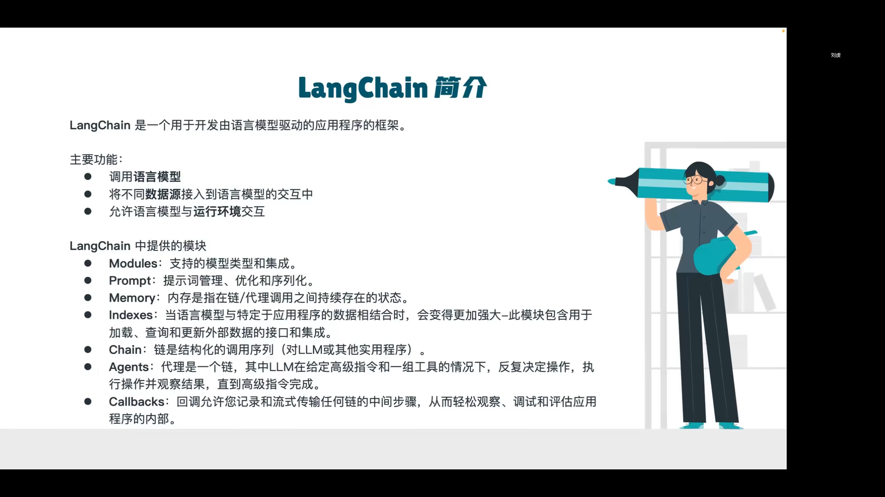
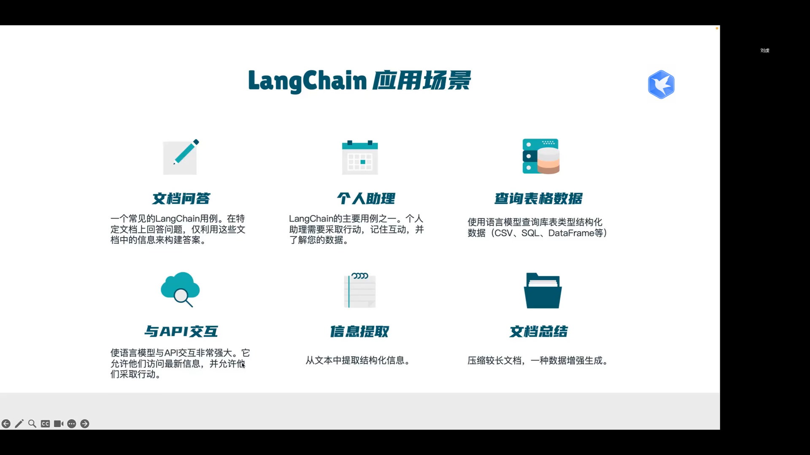
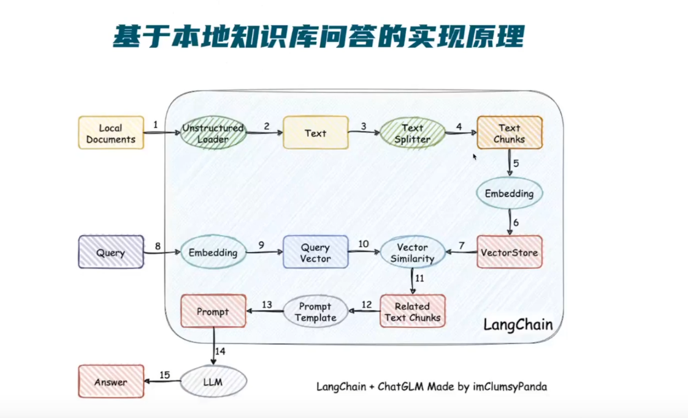
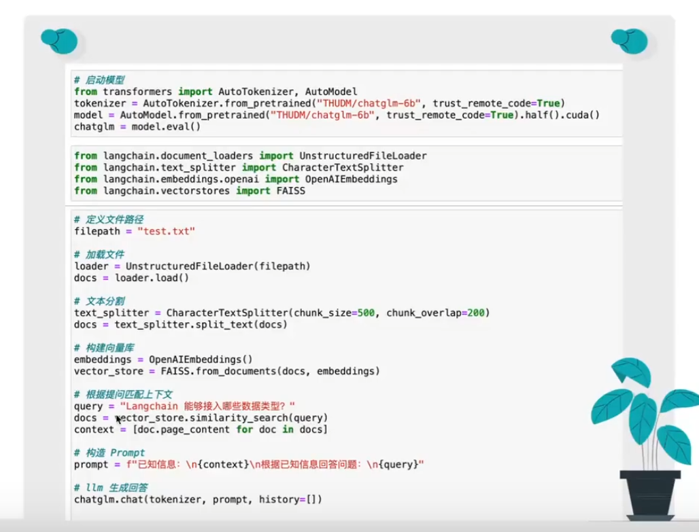

# LangChain学习笔记

## 一.相关资料
1. 官方的网站
   - https://langchain.com/
   - https://python.langchain.com/en/latest/
   - https://blog.langchain.dev/
2. 中文的网站
   - https://www.langchain.com.cn/
   - https://www.langchain.cn/
3. 参考课程笔记
   - https://blog.csdn.net/wenxingchen?type=blog

## 二. 总结
1. 6大核心模块
    - 代理（Agents)
    - 链（Chains)
    - 索引（Indexes)
    - 记忆存储（Memory)
    - 模型（Models)
    - 提示工程（Prompts)
2. 应用案例
    - 智能体仿真（Agent Simulations）
    - API（APIs）
    - 自主代理（Autonomous Agents）
    - 聊天机器人（Chatbots）
    - 代码（Code）
    - 评估（Evaluation）
    - 提取（Extraction）
    - 个人助手（Personal Assistants）
    - 问答（Question Answering）
    - 摘要（Summarization）
    - 表格（Tabular）
    - agents
## 三. 课程1
AI应用开发LangChain系列课程 https://www.bilibili.com/video/BV1Uh4y1X76G
1. 01-LangChain开发AI应用必备框架
1. 02-开发第一个langchain应用：聊天与多轮聊天
1. 03-langchain封装提示词：提示词模板与变量替换
1. 04-示例选择器生成精准提示词：示例选择
1. 05-使用输出解析器格式化输出：
1. 06-任务链完成思考和工作流程
1. 07-AI代理人的决策和行动：使用google搜索找到答案
1. 08-总结长文本摘要：知识库拆分
1. 09-使用文档作为上下文的问答：embedding检索
1. 10-AI自动评估文档答案
1. 11-LangChain查询数据库获取信息
1. 12-自动解析代码库-理解并根据需要生成代码
1. 13-自动读取API文档根据需求自动调用文档获取信息

## 四. 个人总结

学完了：简单说就是封装了对语言模型的调用。  比如拼凑提示词，超限的知识库拆分，embeding检索，多个语言模型多次调用的链...等等
好处还是 调用封装，更加方便。

比如  字数超限的本地知识库拆分，估计大部分人都会遇到，直接封装好
还有embedding的检索，不用自己写了，全部封装好

## 五. LangChain-chatGLM项目
https://www.bilibili.com/video/BV13M4y1e7cN/

