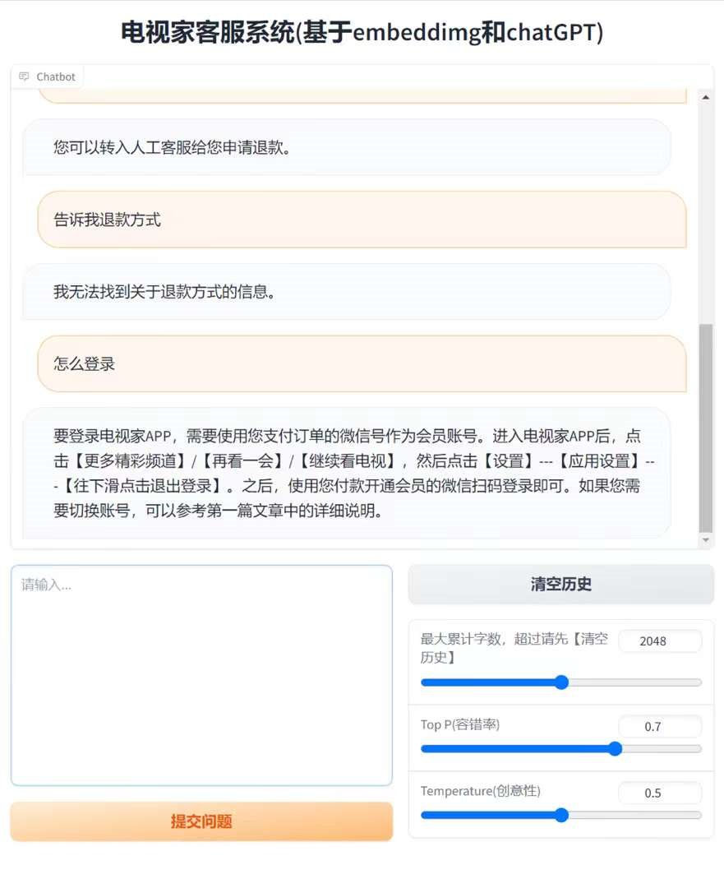

# chatGPT应用
> 怎么用chatGPT解决具体问题：看病问诊，客服问答，风水占卜？
1.  直接使用：把数据给chatGPT做阅读理解，然后提问。（全文传递，可以先过滤）
2. embedding：数据做向量相关性过滤后给chatGPT做阅读理解。（相关文本传递）
3. 开发一个chatGPT插件：让chatGPT服务器调你接口获取数据。（最好的方式）

下面实现一个embedding方式：
