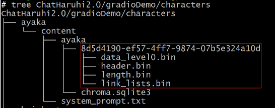

# haruhi-02-源码阅读

## 一. 读grdioDemo
> Chat-Haruhi-Suzumiya/ChatHaruhi2.0/app.py
1. 先下载所有人物数据，且数据已经存储到向量数据库
    
2. 给每角色构建一个ChatHaruhi对象
3. 生成：记录历史+调用chat函数
    
## 二. 读ChatHaruhi
> Chat-Haruhi-Suzumiya/ChatHaruhi2.0/ChatHaruhi
1. 初始化：构造大模型和打开数据库
    - 很多总方式
2. chat
    

## 三. 读数据集制作

