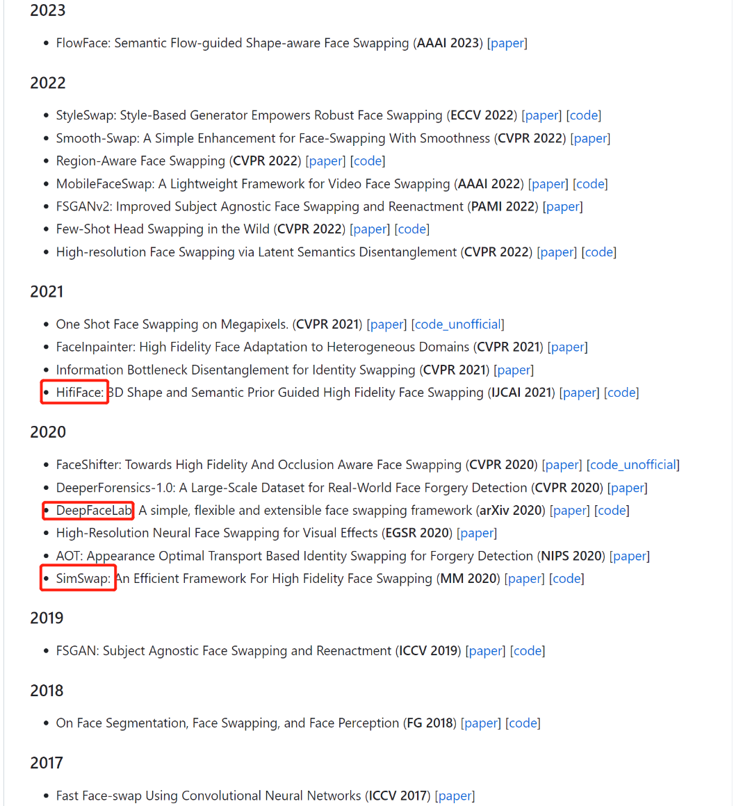
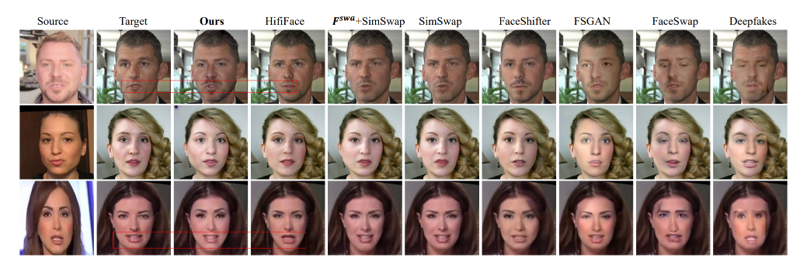
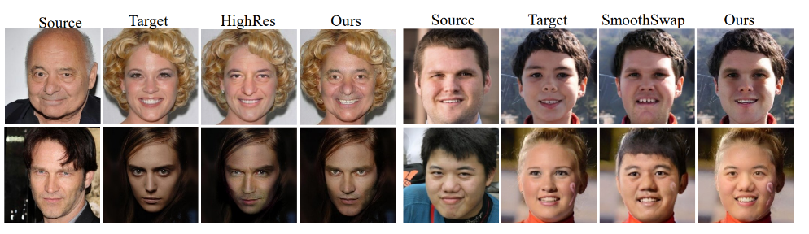

# 换脸-01-概述
> 目标：单图、低成本换脸

https://github.com/e4s2022/e4s

这两个效果不错：
1. https://github.com/s0md3v/roop
2. https://github.com/iperov/DeepFaceLive

三种方案我都试过了：
1. 用ai绘图的图生图脸部局部重绘 +  训练一个lora模型 --- 太慢了成本差
2. 单图不训练直接换脸--侧脸很难处理，适合做一些正脸的高能片段
3. deepfacelab--效果最好

## 一. 结论
1. 之前研究过的方案，都不太可行
    - stableDiffusion：目标脸用提示词确定，相当关开盲盒
    - stableDiffusion + lora：需要对每个人训练
    - DeepFaceLab：需要对每个人训练，又慢有麻烦
2. 准备去探索几个换脸方案
    - ~~insightface~~: 换脸模型(inswapper_128.onnx.zip)不让下载了，换脸迁移到了discord bot 
    - SimSwap + SimSwapPlus 
    - HifiFace
    - FaceDancer https://huggingface.co/spaces/felixrosberg/face-swap
    - MobileFaceSwap
1. FaceFusion
   - 下一代的换脸方案和
   - https://github.com/facefusion/facefusion
   
## 二. 开源方案汇总
- [insightface](https://github.com/deepinsight/insightface/blob/master/examples/in_swapper/README.md)
- https://github.com/DaddyJin/awesome-faceSwap

## 三. 市场概述
> 来自FlowFace的论文

