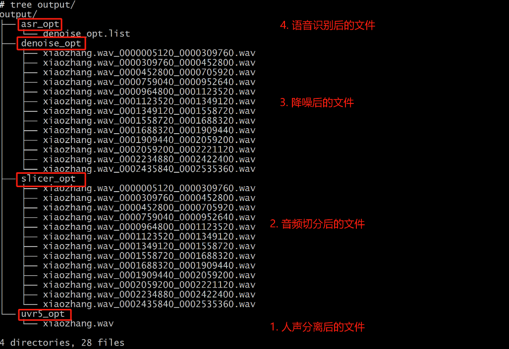
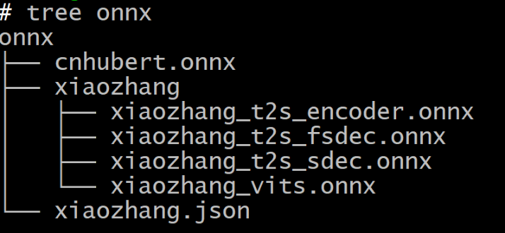

# gpt_sovits原理训练和推理

## 一. 概述
1. 特征：
    - 极速声音克隆：1分钟数据、5-10分钟训练。
    - 跨语种声音克隆：中日英
    - 变声：未实现

## 二. 训练和推理一次
1. 教程：https://www.bilibili.com/video/BV12g4y1m7Uw
2. 4个界面
   - 主界面(训练界面)：runtime\python.exe webui.py :  http://0.0.0.0:9874
   - 声音分离界面：runtime\python.exe" tools/uvr5/webui.py ：http://0.0.0.0:9873
   - 语言识别结果校对界面：runtime\python.exe tools/uvr5/webui.py:  http://0.0.0.0:9873
   - 推理界面：runtime\python.exe" GPT_SoVITS/inference_webui.py：http://0.0.0.0:9872
3. 使用流程
   1. 训练数据清理：
   2. 训练数据预处理：
   3. 训练和推理
4 .模型权重文件
   - 

##  三. 导出onnx
.\runtime\python.exe .\GPT_SoVITS\onnx_export.py

输入输出尺寸：
```
ssl inputs[0]:161920 x 1 x 1 x 1 x 2
ssl outputs[0]:505 x 768 x 1 x 1 x 3
encoder_inputs[0]:37 x 1 x 1 x 1 x 2
encoder_inputs[1]:72 x 1 x 1 x 1 x 2
encoder_inputs[2]:1024 x 37 x 1 x 1 x 2
encoder_inputs[3]:1024 x 72 x 1 x 1 x 2
encoder_inputs[4]:505 x 768 x 1 x 1 x 3
encoder_outputs[0]:512 x 109 x 1 x 1 x 3
encoder_outputs[1]:252 x 1 x 1 x 1 x 2
fs_decoder_inputs[0]:512 x 109 x 1 x 1 x 3
fs_decoder_inputs[1]:252 x 1 x 1 x 1 x 2
fs_decoder_outputs[0]:253 x 1 x 1 x 1 x 2
fs_decoder_outputs[1]:512 x 1 x 361 x 24 x 4
fs_decoder_outputs[2]:512 x 1 x 361 x 24 x 4
fs_decoder_outputs[3]:512 x 252 x 1 x 1 x 3
fs_decoder_outputs[4]:109 x 1 x 1 x 1 x 2
1-decoder_inputs[0]:253 x 1 x 1 x 1 x 2
1-decoder_inputs[1]:512 x 1 x 361 x 24 x 4
1-decoder_inputs[2]:512 x 1 x 361 x 24 x 4
1-decoder_inputs[3]:512 x 252 x 1 x 1 x 3
1-decoder_inputs[4]:109 x 1 x 1 x 1 x 2
1-decoder_outputs[0]:253 x 1 x 1 x 1 x 2
1-decoder_outputs[1]:512 x 1 x 361 x 24 x 4
1-decoder_outputs[2]:512 x 1 x 361 x 24 x 4
1-decoder_outputs[3]:512 x 252 x 1 x 1 x 3
1-decoder_outputs[4]:109 x 1 x 1 x 1 x 2
2-decoder_inputs[0]:254 x 1 x 1 x 1 x 2
2-decoder_inputs[1]:512 x 1 x 362 x 24 x 4
2-decoder_inputs[2]:512 x 1 x 362 x 24 x 4
2-decoder_inputs[3]:512 x 253 x 1 x 1 x 3
2-decoder_inputs[4]:109 x 1 x 1 x 1 x 2
2-decoder_outputs[0]:255 x 1 x 1 x 1 x 2
2-decoder_outputs[1]:512 x 1 x 363 x 24 x 4
2-decoder_outputs[2]:512 x 1 x 363 x 24 x 4
2-decoder_outputs[3]:512 x 254 x 1 x 1 x 3
2-decoder_outputs[4]:109 x 1 x 1 x 1 x 2
3-decoder_inputs[0]:255 x 1 x 1 x 1 x 2
3-decoder_inputs[1]:512 x 1 x 363 x 24 x 4
3-decoder_inputs[2]:512 x 1 x 363 x 24 x 4
3-decoder_inputs[3]:512 x 254 x 1 x 1 x 3
3-decoder_inputs[4]:109 x 1 x 1 x 1 x 2
3-decoder_outputs[0]:256 x 1 x 1 x 1 x 2
3-decoder_outputs[1]:512 x 1 x 364 x 24 x 4
3-decoder_outputs[2]:512 x 1 x 364 x 24 x 4
3-decoder_outputs[3]:512 x 255 x 1 x 1 x 3
3-decoder_outputs[4]:109 x 1 x 1 x 1 x 2
4-decoder_inputs[0]:256 x 1 x 1 x 1 x 2
4-decoder_inputs[1]:512 x 1 x 364 x 24 x 4
4-decoder_inputs[2]:512 x 1 x 364 x 24 x 4
4-decoder_inputs[3]:512 x 255 x 1 x 1 x 3
4-decoder_inputs[4]:109 x 1 x 1 x 1 x 2
4-decoder_outputs[0]:257 x 1 x 1 x 1 x 2
4-decoder_outputs[1]:512 x 1 x 365 x 24 x 4
4-decoder_outputs[2]:512 x 1 x 365 x 24 x 4
4-decoder_outputs[3]:512 x 256 x 1 x 1 x 3
4-decoder_outputs[4]:109 x 1 x 1 x 1 x 2
5-decoder_inputs[0]:257 x 1 x 1 x 1 x 2
5-decoder_inputs[1]:512 x 1 x 365 x 24 x 4
5-decoder_inputs[2]:512 x 1 x 365 x 24 x 4
5-decoder_inputs[3]:512 x 256 x 1 x 1 x 3
5-decoder_inputs[4]:109 x 1 x 1 x 1 x 2
5-decoder_outputs[0]:258 x 1 x 1 x 1 x 2
5-decoder_outputs[1]:512 x 1 x 366 x 24 x 4
5-decoder_outputs[2]:512 x 1 x 366 x 24 x 4
5-decoder_outputs[3]:512 x 257 x 1 x 1 x 3
5-decoder_outputs[4]:109 x 1 x 1 x 1 x 2
6-decoder_inputs[0]:258 x 1 x 1 x 1 x 2
6-decoder_inputs[1]:512 x 1 x 366 x 24 x 4
6-decoder_inputs[2]:512 x 1 x 366 x 24 x 4
6-decoder_inputs[3]:512 x 257 x 1 x 1 x 3
6-decoder_inputs[4]:109 x 1 x 1 x 1 x 2
6-decoder_outputs[0]:259 x 1 x 1 x 1 x 2
6-decoder_outputs[1]:512 x 1 x 367 x 24 x 4
6-decoder_outputs[2]:512 x 1 x 367 x 24 x 4
6-decoder_outputs[3]:512 x 258 x 1 x 1 x 3
6-decoder_outputs[4]:109 x 1 x 1 x 1 x 2
7-decoder_inputs[0]:259 x 1 x 1 x 1 x 2
7-decoder_inputs[1]:512 x 1 x 367 x 24 x 4
7-decoder_inputs[2]:512 x 1 x 367 x 24 x 4
7-decoder_inputs[3]:512 x 258 x 1 x 1 x 3
7-decoder_inputs[4]:109 x 1 x 1 x 1 x 2
7-decoder_outputs[0]:260 x 1 x 1 x 1 x 2
7-decoder_outputs[1]:512 x 1 x 368 x 24 x 4
7-decoder_outputs[2]:512 x 1 x 368 x 24 x 4
7-decoder_outputs[3]:512 x 259 x 1 x 1 x 3
7-decoder_outputs[4]:109 x 1 x 1 x 1 x 2
8-decoder_inputs[0]:260 x 1 x 1 x 1 x 2
8-decoder_inputs[1]:512 x 1 x 368 x 24 x 4
8-decoder_inputs[2]:512 x 1 x 368 x 24 x 4
8-decoder_inputs[3]:512 x 259 x 1 x 1 x 3
8-decoder_inputs[4]:109 x 1 x 1 x 1 x 2
8-decoder_outputs[0]:261 x 1 x 1 x 1 x 2
8-decoder_outputs[1]:512 x 1 x 369 x 24 x 4
8-decoder_outputs[2]:512 x 1 x 369 x 24 x 4
8-decoder_outputs[3]:512 x 260 x 1 x 1 x 3
8-decoder_outputs[4]:109 x 1 x 1 x 1 x 2
9-decoder_inputs[0]:261 x 1 x 1 x 1 x 2
9-decoder_inputs[1]:512 x 1 x 369 x 24 x 4
9-decoder_inputs[2]:512 x 1 x 369 x 24 x 4
9-decoder_inputs[3]:512 x 260 x 1 x 1 x 3
9-decoder_inputs[4]:109 x 1 x 1 x 1 x 2
9-decoder_outputs[0]:262 x 1 x 1 x 1 x 2
9-decoder_outputs[1]:512 x 1 x 370 x 24 x 4
9-decoder_outputs[2]:512 x 1 x 370 x 24 x 4
9-decoder_outputs[3]:512 x 261 x 1 x 1 x 3
9-decoder_outputs[4]:109 x 1 x 1 x 1 x 2
10-decoder_inputs[0]:262 x 1 x 1 x 1 x 2
10-decoder_inputs[1]:512 x 1 x 370 x 24 x 4
10-decoder_inputs[2]:512 x 1 x 370 x 24 x 4
10-decoder_inputs[3]:512 x 261 x 1 x 1 x 3
10-decoder_inputs[4]:109 x 1 x 1 x 1 x 2
10-decoder_outputs[0]:263 x 1 x 1 x 1 x 2
10-decoder_outputs[1]:512 x 1 x 371 x 24 x 4
10-decoder_outputs[2]:512 x 1 x 371 x 24 x 4
10-decoder_outputs[3]:512 x 262 x 1 x 1 x 3
10-decoder_outputs[4]:109 x 1 x 1 x 1 x 2
11-decoder_inputs[0]:263 x 1 x 1 x 1 x 2
11-decoder_inputs[1]:512 x 1 x 371 x 24 x 4
11-decoder_inputs[2]:512 x 1 x 371 x 24 x 4
11-decoder_inputs[3]:512 x 262 x 1 x 1 x 3
11-decoder_inputs[4]:109 x 1 x 1 x 1 x 2
11-decoder_outputs[0]:264 x 1 x 1 x 1 x 2
11-decoder_outputs[1]:512 x 1 x 372 x 24 x 4
11-decoder_outputs[2]:512 x 1 x 372 x 24 x 4
11-decoder_outputs[3]:512 x 263 x 1 x 1 x 3
11-decoder_outputs[4]:109 x 1 x 1 x 1 x 2
12-decoder_inputs[0]:264 x 1 x 1 x 1 x 2
12-decoder_inputs[1]:512 x 1 x 372 x 24 x 4
12-decoder_inputs[2]:512 x 1 x 372 x 24 x 4
12-decoder_inputs[3]:512 x 263 x 1 x 1 x 3
12-decoder_inputs[4]:109 x 1 x 1 x 1 x 2
12-decoder_outputs[0]:265 x 1 x 1 x 1 x 2
12-decoder_outputs[1]:512 x 1 x 373 x 24 x 4
12-decoder_outputs[2]:512 x 1 x 373 x 24 x 4
12-decoder_outputs[3]:512 x 264 x 1 x 1 x 3
12-decoder_outputs[4]:109 x 1 x 1 x 1 x 2
13-decoder_inputs[0]:265 x 1 x 1 x 1 x 2
13-decoder_inputs[1]:512 x 1 x 373 x 24 x 4
13-decoder_inputs[2]:512 x 1 x 373 x 24 x 4
13-decoder_inputs[3]:512 x 264 x 1 x 1 x 3
13-decoder_inputs[4]:109 x 1 x 1 x 1 x 2
13-decoder_outputs[0]:266 x 1 x 1 x 1 x 2
13-decoder_outputs[1]:512 x 1 x 374 x 24 x 4
13-decoder_outputs[2]:512 x 1 x 374 x 24 x 4
13-decoder_outputs[3]:512 x 265 x 1 x 1 x 3
13-decoder_outputs[4]:109 x 1 x 1 x 1 x 2
14-decoder_inputs[0]:266 x 1 x 1 x 1 x 2
14-decoder_inputs[1]:512 x 1 x 374 x 24 x 4
14-decoder_inputs[2]:512 x 1 x 374 x 24 x 4
14-decoder_inputs[3]:512 x 265 x 1 x 1 x 3
14-decoder_inputs[4]:109 x 1 x 1 x 1 x 2
14-decoder_outputs[0]:267 x 1 x 1 x 1 x 2
14-decoder_outputs[1]:512 x 1 x 375 x 24 x 4
14-decoder_outputs[2]:512 x 1 x 375 x 24 x 4
14-decoder_outputs[3]:512 x 266 x 1 x 1 x 3
14-decoder_outputs[4]:109 x 1 x 1 x 1 x 2
15-decoder_inputs[0]:267 x 1 x 1 x 1 x 2
15-decoder_inputs[1]:512 x 1 x 375 x 24 x 4
15-decoder_inputs[2]:512 x 1 x 375 x 24 x 4
15-decoder_inputs[3]:512 x 266 x 1 x 1 x 3
15-decoder_inputs[4]:109 x 1 x 1 x 1 x 2
15-decoder_outputs[0]:268 x 1 x 1 x 1 x 2
15-decoder_outputs[1]:512 x 1 x 376 x 24 x 4
15-decoder_outputs[2]:512 x 1 x 376 x 24 x 4
15-decoder_outputs[3]:512 x 267 x 1 x 1 x 3
15-decoder_outputs[4]:109 x 1 x 1 x 1 x 2
16-decoder_inputs[0]:268 x 1 x 1 x 1 x 2
16-decoder_inputs[1]:512 x 1 x 376 x 24 x 4
16-decoder_inputs[2]:512 x 1 x 376 x 24 x 4
16-decoder_inputs[3]:512 x 267 x 1 x 1 x 3
16-decoder_inputs[4]:109 x 1 x 1 x 1 x 2
16-decoder_outputs[0]:269 x 1 x 1 x 1 x 2
16-decoder_outputs[1]:512 x 1 x 377 x 24 x 4
16-decoder_outputs[2]:512 x 1 x 377 x 24 x 4
16-decoder_outputs[3]:512 x 268 x 1 x 1 x 3
16-decoder_outputs[4]:109 x 1 x 1 x 1 x 2
17-decoder_inputs[0]:269 x 1 x 1 x 1 x 2
17-decoder_inputs[1]:512 x 1 x 377 x 24 x 4
17-decoder_inputs[2]:512 x 1 x 377 x 24 x 4
17-decoder_inputs[3]:512 x 268 x 1 x 1 x 3
17-decoder_inputs[4]:109 x 1 x 1 x 1 x 2
17-decoder_outputs[0]:270 x 1 x 1 x 1 x 2
17-decoder_outputs[1]:512 x 1 x 378 x 24 x 4
17-decoder_outputs[2]:512 x 1 x 378 x 24 x 4
17-decoder_outputs[3]:512 x 269 x 1 x 1 x 3
17-decoder_outputs[4]:109 x 1 x 1 x 1 x 2
18-decoder_inputs[0]:270 x 1 x 1 x 1 x 2
18-decoder_inputs[1]:512 x 1 x 378 x 24 x 4
18-decoder_inputs[2]:512 x 1 x 378 x 24 x 4
18-decoder_inputs[3]:512 x 269 x 1 x 1 x 3
18-decoder_inputs[4]:109 x 1 x 1 x 1 x 2
18-decoder_outputs[0]:271 x 1 x 1 x 1 x 2
18-decoder_outputs[1]:512 x 1 x 379 x 24 x 4
18-decoder_outputs[2]:512 x 1 x 379 x 24 x 4
18-decoder_outputs[3]:512 x 270 x 1 x 1 x 3
18-decoder_outputs[4]:109 x 1 x 1 x 1 x 2
19-decoder_inputs[0]:271 x 1 x 1 x 1 x 2
19-decoder_inputs[1]:512 x 1 x 379 x 24 x 4
19-decoder_inputs[2]:512 x 1 x 379 x 24 x 4
19-decoder_inputs[3]:512 x 270 x 1 x 1 x 3
19-decoder_inputs[4]:109 x 1 x 1 x 1 x 2
19-decoder_outputs[0]:272 x 1 x 1 x 1 x 2
19-decoder_outputs[1]:512 x 1 x 380 x 24 x 4
19-decoder_outputs[2]:512 x 1 x 380 x 24 x 4
19-decoder_outputs[3]:512 x 271 x 1 x 1 x 3
19-decoder_outputs[4]:109 x 1 x 1 x 1 x 2
20-decoder_inputs[0]:272 x 1 x 1 x 1 x 2
20-decoder_inputs[1]:512 x 1 x 380 x 24 x 4
20-decoder_inputs[2]:512 x 1 x 380 x 24 x 4
20-decoder_inputs[3]:512 x 271 x 1 x 1 x 3
20-decoder_inputs[4]:109 x 1 x 1 x 1 x 2
20-decoder_outputs[0]:273 x 1 x 1 x 1 x 2
20-decoder_outputs[1]:512 x 1 x 381 x 24 x 4
20-decoder_outputs[2]:512 x 1 x 381 x 24 x 4
20-decoder_outputs[3]:512 x 272 x 1 x 1 x 3
20-decoder_outputs[4]:109 x 1 x 1 x 1 x 2
21-decoder_inputs[0]:273 x 1 x 1 x 1 x 2
21-decoder_inputs[1]:512 x 1 x 381 x 24 x 4
21-decoder_inputs[2]:512 x 1 x 381 x 24 x 4
21-decoder_inputs[3]:512 x 272 x 1 x 1 x 3
21-decoder_inputs[4]:109 x 1 x 1 x 1 x 2
21-decoder_outputs[0]:274 x 1 x 1 x 1 x 2
21-decoder_outputs[1]:512 x 1 x 382 x 24 x 4
21-decoder_outputs[2]:512 x 1 x 382 x 24 x 4
21-decoder_outputs[3]:512 x 273 x 1 x 1 x 3
21-decoder_outputs[4]:109 x 1 x 1 x 1 x 2
22-decoder_inputs[0]:274 x 1 x 1 x 1 x 2
22-decoder_inputs[1]:512 x 1 x 382 x 24 x 4
22-decoder_inputs[2]:512 x 1 x 382 x 24 x 4
22-decoder_inputs[3]:512 x 273 x 1 x 1 x 3
22-decoder_inputs[4]:109 x 1 x 1 x 1 x 2
22-decoder_outputs[0]:275 x 1 x 1 x 1 x 2
22-decoder_outputs[1]:512 x 1 x 383 x 24 x 4
22-decoder_outputs[2]:512 x 1 x 383 x 24 x 4
22-decoder_outputs[3]:512 x 274 x 1 x 1 x 3
22-decoder_outputs[4]:109 x 1 x 1 x 1 x 2
23-decoder_inputs[0]:275 x 1 x 1 x 1 x 2
23-decoder_inputs[1]:512 x 1 x 383 x 24 x 4
23-decoder_inputs[2]:512 x 1 x 383 x 24 x 4
23-decoder_inputs[3]:512 x 274 x 1 x 1 x 3
23-decoder_inputs[4]:109 x 1 x 1 x 1 x 2
23-decoder_outputs[0]:276 x 1 x 1 x 1 x 2
23-decoder_outputs[1]:512 x 1 x 384 x 24 x 4
23-decoder_outputs[2]:512 x 1 x 384 x 24 x 4
23-decoder_outputs[3]:512 x 275 x 1 x 1 x 3
23-decoder_outputs[4]:109 x 1 x 1 x 1 x 2
24-decoder_inputs[0]:276 x 1 x 1 x 1 x 2
24-decoder_inputs[1]:512 x 1 x 384 x 24 x 4
24-decoder_inputs[2]:512 x 1 x 384 x 24 x 4
24-decoder_inputs[3]:512 x 275 x 1 x 1 x 3
24-decoder_inputs[4]:109 x 1 x 1 x 1 x 2
24-decoder_outputs[0]:277 x 1 x 1 x 1 x 2
24-decoder_outputs[1]:512 x 1 x 385 x 24 x 4
24-decoder_outputs[2]:512 x 1 x 385 x 24 x 4
24-decoder_outputs[3]:512 x 276 x 1 x 1 x 3
24-decoder_outputs[4]:109 x 1 x 1 x 1 x 2
25-decoder_inputs[0]:277 x 1 x 1 x 1 x 2
25-decoder_inputs[1]:512 x 1 x 385 x 24 x 4
25-decoder_inputs[2]:512 x 1 x 385 x 24 x 4
25-decoder_inputs[3]:512 x 276 x 1 x 1 x 3
25-decoder_inputs[4]:109 x 1 x 1 x 1 x 2
25-decoder_outputs[0]:278 x 1 x 1 x 1 x 2
25-decoder_outputs[1]:512 x 1 x 386 x 24 x 4
25-decoder_outputs[2]:512 x 1 x 386 x 24 x 4
25-decoder_outputs[3]:512 x 277 x 1 x 1 x 3
25-decoder_outputs[4]:109 x 1 x 1 x 1 x 2
26-decoder_inputs[0]:278 x 1 x 1 x 1 x 2
26-decoder_inputs[1]:512 x 1 x 386 x 24 x 4
26-decoder_inputs[2]:512 x 1 x 386 x 24 x 4
26-decoder_inputs[3]:512 x 277 x 1 x 1 x 3
26-decoder_inputs[4]:109 x 1 x 1 x 1 x 2
26-decoder_outputs[0]:279 x 1 x 1 x 1 x 2
26-decoder_outputs[1]:512 x 1 x 387 x 24 x 4
26-decoder_outputs[2]:512 x 1 x 387 x 24 x 4
26-decoder_outputs[3]:512 x 278 x 1 x 1 x 3
26-decoder_outputs[4]:109 x 1 x 1 x 1 x 2
27-decoder_inputs[0]:279 x 1 x 1 x 1 x 2
27-decoder_inputs[1]:512 x 1 x 387 x 24 x 4
27-decoder_inputs[2]:512 x 1 x 387 x 24 x 4
27-decoder_inputs[3]:512 x 278 x 1 x 1 x 3
27-decoder_inputs[4]:109 x 1 x 1 x 1 x 2
27-decoder_outputs[0]:280 x 1 x 1 x 1 x 2
27-decoder_outputs[1]:512 x 1 x 388 x 24 x 4
27-decoder_outputs[2]:512 x 1 x 388 x 24 x 4
27-decoder_outputs[3]:512 x 279 x 1 x 1 x 3
27-decoder_outputs[4]:109 x 1 x 1 x 1 x 2
28-decoder_inputs[0]:280 x 1 x 1 x 1 x 2
28-decoder_inputs[1]:512 x 1 x 388 x 24 x 4
28-decoder_inputs[2]:512 x 1 x 388 x 24 x 4
28-decoder_inputs[3]:512 x 279 x 1 x 1 x 3
28-decoder_inputs[4]:109 x 1 x 1 x 1 x 2
28-decoder_outputs[0]:281 x 1 x 1 x 1 x 2
28-decoder_outputs[1]:512 x 1 x 389 x 24 x 4
28-decoder_outputs[2]:512 x 1 x 389 x 24 x 4
28-decoder_outputs[3]:512 x 280 x 1 x 1 x 3
28-decoder_outputs[4]:109 x 1 x 1 x 1 x 2
29-decoder_inputs[0]:281 x 1 x 1 x 1 x 2
29-decoder_inputs[1]:512 x 1 x 389 x 24 x 4
29-decoder_inputs[2]:512 x 1 x 389 x 24 x 4
29-decoder_inputs[3]:512 x 280 x 1 x 1 x 3
29-decoder_inputs[4]:109 x 1 x 1 x 1 x 2
29-decoder_outputs[0]:282 x 1 x 1 x 1 x 2
29-decoder_outputs[1]:512 x 1 x 390 x 24 x 4
29-decoder_outputs[2]:512 x 1 x 390 x 24 x 4
29-decoder_outputs[3]:512 x 281 x 1 x 1 x 3
29-decoder_outputs[4]:109 x 1 x 1 x 1 x 2
30-decoder_inputs[0]:282 x 1 x 1 x 1 x 2
30-decoder_inputs[1]:512 x 1 x 390 x 24 x 4
30-decoder_inputs[2]:512 x 1 x 390 x 24 x 4
30-decoder_inputs[3]:512 x 281 x 1 x 1 x 3
30-decoder_inputs[4]:109 x 1 x 1 x 1 x 2
30-decoder_outputs[0]:283 x 1 x 1 x 1 x 2
30-decoder_outputs[1]:512 x 1 x 391 x 24 x 4
30-decoder_outputs[2]:512 x 1 x 391 x 24 x 4
30-decoder_outputs[3]:512 x 282 x 1 x 1 x 3
30-decoder_outputs[4]:109 x 1 x 1 x 1 x 2
31-decoder_inputs[0]:283 x 1 x 1 x 1 x 2
31-decoder_inputs[1]:512 x 1 x 391 x 24 x 4
31-decoder_inputs[2]:512 x 1 x 391 x 24 x 4
31-decoder_inputs[3]:512 x 282 x 1 x 1 x 3
31-decoder_inputs[4]:109 x 1 x 1 x 1 x 2
31-decoder_outputs[0]:284 x 1 x 1 x 1 x 2
31-decoder_outputs[1]:512 x 1 x 392 x 24 x 4
31-decoder_outputs[2]:512 x 1 x 392 x 24 x 4
31-decoder_outputs[3]:512 x 283 x 1 x 1 x 3
31-decoder_outputs[4]:109 x 1 x 1 x 1 x 2
32-decoder_inputs[0]:284 x 1 x 1 x 1 x 2
32-decoder_inputs[1]:512 x 1 x 392 x 24 x 4
32-decoder_inputs[2]:512 x 1 x 392 x 24 x 4
32-decoder_inputs[3]:512 x 283 x 1 x 1 x 3
32-decoder_inputs[4]:109 x 1 x 1 x 1 x 2
32-decoder_outputs[0]:285 x 1 x 1 x 1 x 2
32-decoder_outputs[1]:512 x 1 x 393 x 24 x 4
32-decoder_outputs[2]:512 x 1 x 393 x 24 x 4
32-decoder_outputs[3]:512 x 284 x 1 x 1 x 3
32-decoder_outputs[4]:109 x 1 x 1 x 1 x 2
33-decoder_inputs[0]:285 x 1 x 1 x 1 x 2
33-decoder_inputs[1]:512 x 1 x 393 x 24 x 4
33-decoder_inputs[2]:512 x 1 x 393 x 24 x 4
33-decoder_inputs[3]:512 x 284 x 1 x 1 x 3
33-decoder_inputs[4]:109 x 1 x 1 x 1 x 2
33-decoder_outputs[0]:286 x 1 x 1 x 1 x 2
33-decoder_outputs[1]:512 x 1 x 394 x 24 x 4
33-decoder_outputs[2]:512 x 1 x 394 x 24 x 4
33-decoder_outputs[3]:512 x 285 x 1 x 1 x 3
33-decoder_outputs[4]:109 x 1 x 1 x 1 x 2
34-decoder_inputs[0]:286 x 1 x 1 x 1 x 2
34-decoder_inputs[1]:512 x 1 x 394 x 24 x 4
34-decoder_inputs[2]:512 x 1 x 394 x 24 x 4
34-decoder_inputs[3]:512 x 285 x 1 x 1 x 3
34-decoder_inputs[4]:109 x 1 x 1 x 1 x 2
34-decoder_outputs[0]:287 x 1 x 1 x 1 x 2
34-decoder_outputs[1]:512 x 1 x 395 x 24 x 4
34-decoder_outputs[2]:512 x 1 x 395 x 24 x 4
34-decoder_outputs[3]:512 x 286 x 1 x 1 x 3
34-decoder_outputs[4]:109 x 1 x 1 x 1 x 2
35-decoder_inputs[0]:287 x 1 x 1 x 1 x 2
35-decoder_inputs[1]:512 x 1 x 395 x 24 x 4
35-decoder_inputs[2]:512 x 1 x 395 x 24 x 4
35-decoder_inputs[3]:512 x 286 x 1 x 1 x 3
35-decoder_inputs[4]:109 x 1 x 1 x 1 x 2
35-decoder_outputs[0]:288 x 1 x 1 x 1 x 2
35-decoder_outputs[1]:512 x 1 x 396 x 24 x 4
35-decoder_outputs[2]:512 x 1 x 396 x 24 x 4
35-decoder_outputs[3]:512 x 287 x 1 x 1 x 3
35-decoder_outputs[4]:109 x 1 x 1 x 1 x 2
36-decoder_inputs[0]:288 x 1 x 1 x 1 x 2
36-decoder_inputs[1]:512 x 1 x 396 x 24 x 4
36-decoder_inputs[2]:512 x 1 x 396 x 24 x 4
36-decoder_inputs[3]:512 x 287 x 1 x 1 x 3
36-decoder_inputs[4]:109 x 1 x 1 x 1 x 2
36-decoder_outputs[0]:289 x 1 x 1 x 1 x 2
36-decoder_outputs[1]:512 x 1 x 397 x 24 x 4
36-decoder_outputs[2]:512 x 1 x 397 x 24 x 4
36-decoder_outputs[3]:512 x 288 x 1 x 1 x 3
36-decoder_outputs[4]:109 x 1 x 1 x 1 x 2
37-decoder_inputs[0]:289 x 1 x 1 x 1 x 2
37-decoder_inputs[1]:512 x 1 x 397 x 24 x 4
37-decoder_inputs[2]:512 x 1 x 397 x 24 x 4
37-decoder_inputs[3]:512 x 288 x 1 x 1 x 3
37-decoder_inputs[4]:109 x 1 x 1 x 1 x 2
37-decoder_outputs[0]:290 x 1 x 1 x 1 x 2
37-decoder_outputs[1]:512 x 1 x 398 x 24 x 4
37-decoder_outputs[2]:512 x 1 x 398 x 24 x 4
37-decoder_outputs[3]:512 x 289 x 1 x 1 x 3
37-decoder_outputs[4]:109 x 1 x 1 x 1 x 2
38-decoder_inputs[0]:290 x 1 x 1 x 1 x 2
38-decoder_inputs[1]:512 x 1 x 398 x 24 x 4
38-decoder_inputs[2]:512 x 1 x 398 x 24 x 4
38-decoder_inputs[3]:512 x 289 x 1 x 1 x 3
38-decoder_inputs[4]:109 x 1 x 1 x 1 x 2
38-decoder_outputs[0]:291 x 1 x 1 x 1 x 2
38-decoder_outputs[1]:512 x 1 x 399 x 24 x 4
38-decoder_outputs[2]:512 x 1 x 399 x 24 x 4
38-decoder_outputs[3]:512 x 290 x 1 x 1 x 3
38-decoder_outputs[4]:109 x 1 x 1 x 1 x 2
39-decoder_inputs[0]:291 x 1 x 1 x 1 x 2
39-decoder_inputs[1]:512 x 1 x 399 x 24 x 4
39-decoder_inputs[2]:512 x 1 x 399 x 24 x 4
39-decoder_inputs[3]:512 x 290 x 1 x 1 x 3
39-decoder_inputs[4]:109 x 1 x 1 x 1 x 2
39-decoder_outputs[0]:292 x 1 x 1 x 1 x 2
39-decoder_outputs[1]:512 x 1 x 400 x 24 x 4
39-decoder_outputs[2]:512 x 1 x 400 x 24 x 4
39-decoder_outputs[3]:512 x 291 x 1 x 1 x 3
39-decoder_outputs[4]:109 x 1 x 1 x 1 x 2
40-decoder_inputs[0]:292 x 1 x 1 x 1 x 2
40-decoder_inputs[1]:512 x 1 x 400 x 24 x 4
40-decoder_inputs[2]:512 x 1 x 400 x 24 x 4
40-decoder_inputs[3]:512 x 291 x 1 x 1 x 3
40-decoder_inputs[4]:109 x 1 x 1 x 1 x 2
40-decoder_outputs[0]:293 x 1 x 1 x 1 x 2
40-decoder_outputs[1]:512 x 1 x 401 x 24 x 4
40-decoder_outputs[2]:512 x 1 x 401 x 24 x 4
40-decoder_outputs[3]:512 x 292 x 1 x 1 x 3
40-decoder_outputs[4]:109 x 1 x 1 x 1 x 2
vits_inputs[0]:72 x 1 x 1 x 1 x 2
vits_inputs[1]:39 x 1 x 1 x 1 x 3
vits_inputs[2]:304640 x 1 x 1 x 1 x 2
vits_outputs[0]:49920 x 1 x 1 x 1 x 1
Program finished successfully.
```
输入：
gpt_sovits(ref_seq, text_seq, ref_bert, text_bert, ref_audio_sr, ssl_content).detach().cpu().numpy()


## 四. 预处理
1. get_tts_wav
   - 输入1，参考音频：inp_ref, prompt_text, prompt_language, 
   - 输入2，生成文本：text, text_language, how_to_cut, 
   - 输入3，GPT采样参数：top_k, top_p, temperature, 
   - 是否无参考文本：ref_text_free
2. bert-vits的预处理：jieba，pinyin，g2p
