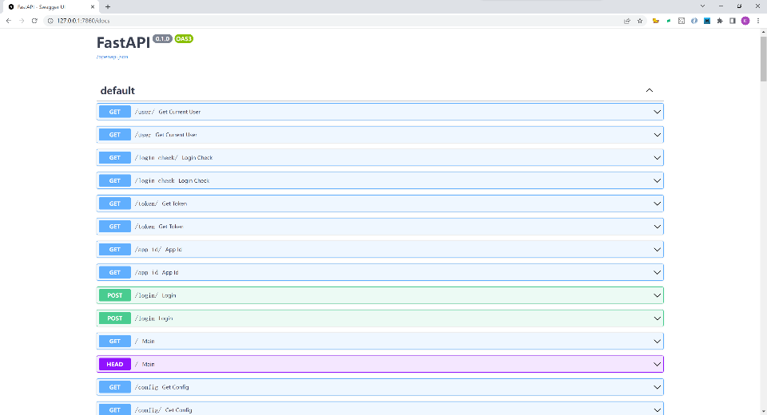
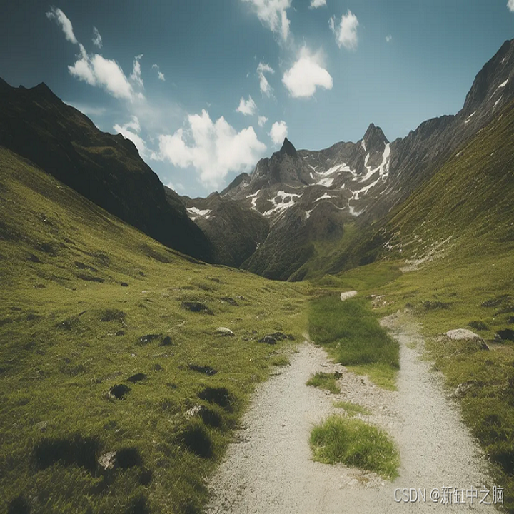

# sd使用10：用api调用sd


## 一. 启动带api的(--api)
```
webui --server-name=0.0.0.0 --share --theme dark --xformers --api --autolaunch
```

## 二. api文档地址
```
http://127.0.0.1:7860/docs
```

## 三. 两个实例
1. 文生图生成小狗：
    - 接口：'http://127.0.0.1:7860/sdapi/v1/txt2img'
    - [代码：sample-request.py](sample-request.py)
    - 运行:
    ```
    python sample-request.py
    ```
    - 
2. 图生图去水印：
    - 接口：'http://127.0.0.1:7860/sdapi/v1/img2img'
    - [代码：inpaint-person.py](inpaint-person.py)
    - 运行：
    ```
    python inpaint-person.py woman-on-trail.png \
     -W 1152 -H 768 \
     -b 16 -B -D 32 \
     -p "mountain scenery, landscape, trail"
    ```
   - 效果
   - 
   - 
3. 总结
   - api调用处理3-7秒一帧
   - 一个10秒20帧的视频需要10分钟处理完： 10 * 20 * 5 / 60

## 四. 参考文档
1. https://towardsdatascience.com/stable-diffusion-as-an-api-5e381aec1f6
2. https://gist.github.com/Mason-McGough/9733aff5bc9d04faecfbb81074617315
2. http://www.bimant.com/blog/stable-diffusion-api/
2. https://blog.csdn.net/shebao3333/article/details/129612118
3. https://blog.csdn.net/qq_36645932/article/details/130183786