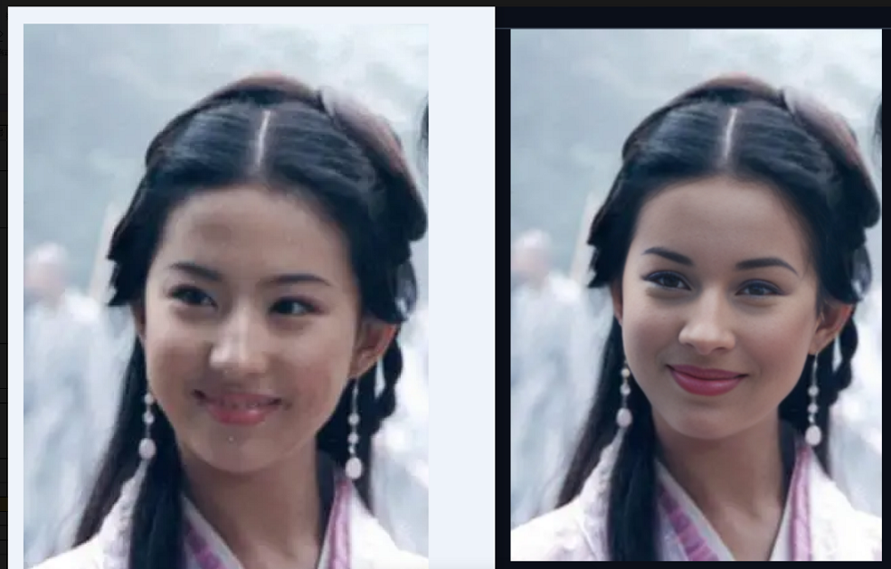
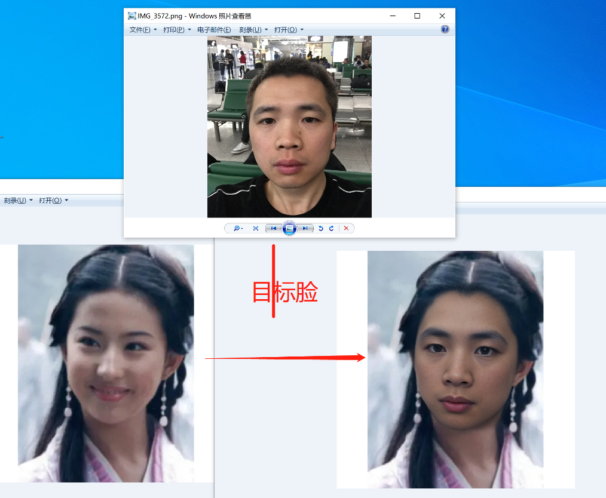
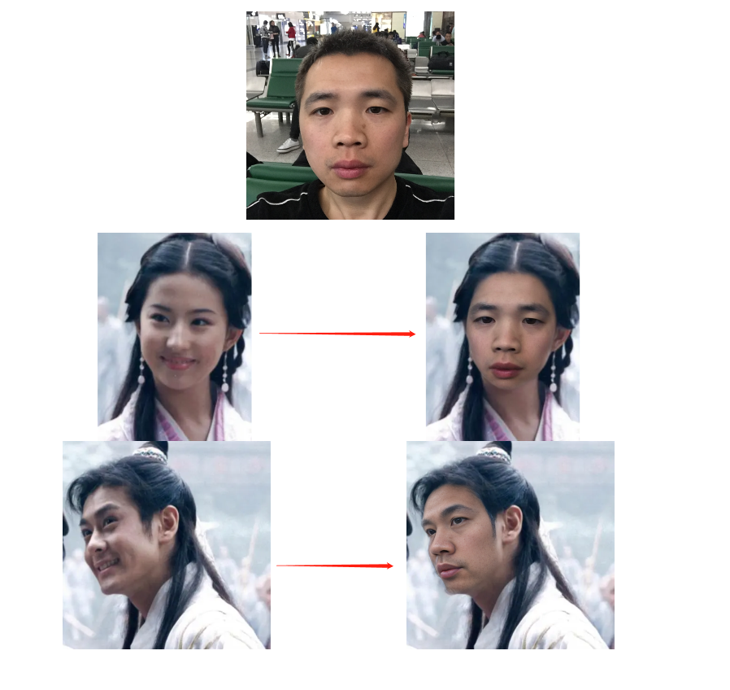

# sd使用11：换脸

## 一. 换脸

- 原理：sd的图生图局部重绘功能
- 问题：不能指定目标脸，只能开盲盒
- 下图方案：单图训练一个lora + sd的图生图局部重绘功能

## 二. 参考
1. 青橙pro的博客：https://author.baidu.com/home?from=bjh_article&app_id=1583016629359045
2. sd换脸插件 https://github.com/kex0/batch-face-swap
3. [AIGC產業需求.pdf](AIGC%AE%61%98%49%D0%E8%C7%F3.pdf)
4. [DiffFace_Diffusion-based_Face_Swapping_with_Facial.pdf](DiffFace_Diffusion-based_Face_Swapping_with_Facial.pdf)
5. https://huke88.com/course/153683.html