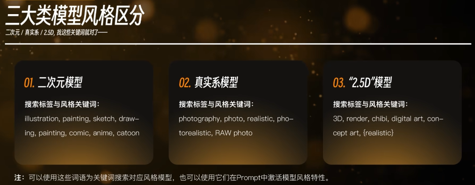
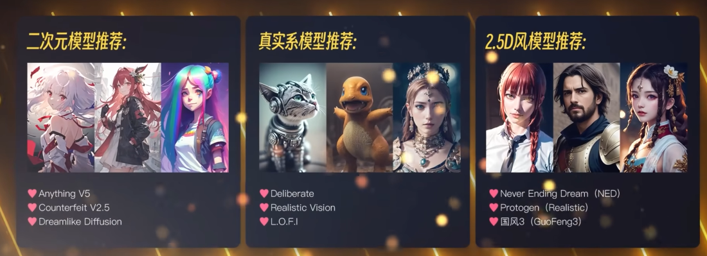
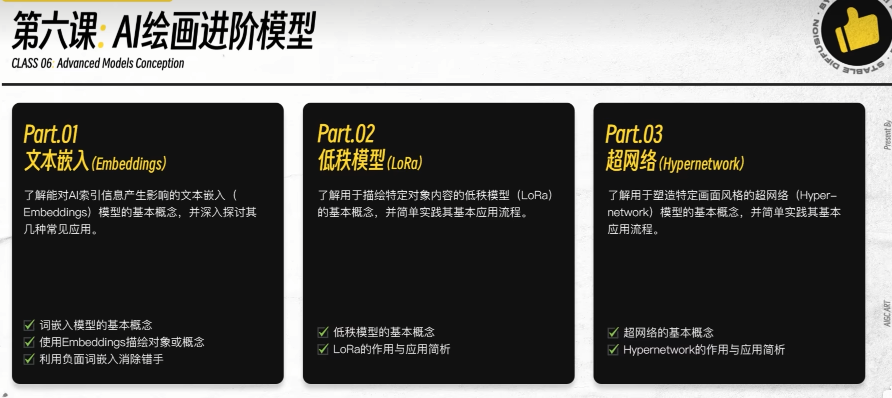

# sd使用4：常见风格模型

## 模型推荐
1. 二次元动漫模型
- Anything V5
- Counterfeit V2.5
- Dreamlike Diffusion

2. 真实系模型
- Deliberate
- Realistic Vision
- LOFI

3. 2.5D风模型
- Never Ending Dream(NED)
- Protogen (Realistic)
- 国风3(GuoFeng3)

## 常用模型
# stable-diffusion-v1-5
1. v1-5-pruned-emaonly.safetensors
3. v1-5-pruned.ckpt

4. AbyssOrangeMix2_sfw.ckpt:二次元

## 模型网址
# https://huggingface.co/models?pipeline_tag=text-to-image&sort=downloads
# https://civitai.com/?tag=objects

## 提示词网址
- https://moonvy.com/apps/ops/
- http://www.atoolbox.net/Tool.php?Id=1101
- https://ai.dawnmark.cn/

## 秋叶的标签超时
- 标签超市(解析组合): https://tags.novelai.dev/
- 原图提取标签: https://spell.novelai.dev/

## ControlNet
- https://github.com/lllyasviel/ControlNet
- https://github.com/lllyasviel/ControlNet-v1-1-nightly

