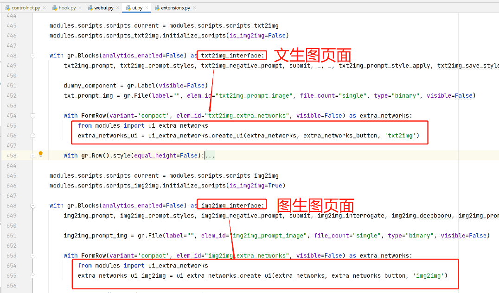
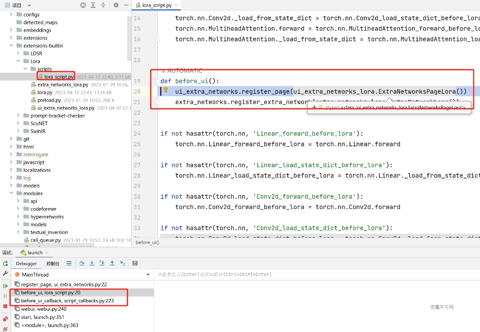
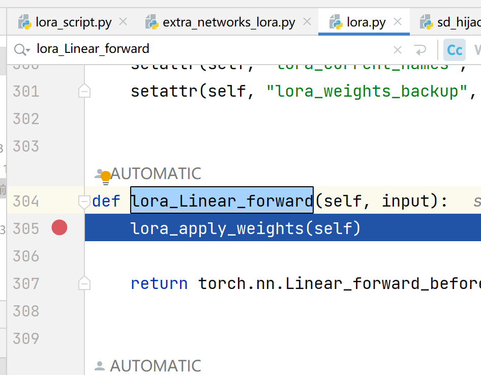

# sd源码分析11：附加模型与lora

## 一. 界面显示



## 二. 加载
1. 先加载三个
```
    shared.reload_hypernetworks()
    startup_timer.record("reload hypernets")

    ui_extra_networks.intialize()
    ui_extra_networks.register_page(ui_extra_networks_textual_inversion.ExtraNetworksPageTextualInversion())
    ui_extra_networks.register_page(ui_extra_networks_hypernets.ExtraNetworksPageHypernetworks())
    ui_extra_networks.register_page(ui_extra_networks_checkpoints.ExtraNetworksPageCheckpoints())

    extra_networks.initialize()
    extra_networks.register_extra_network(extra_networks_hypernet.ExtraNetworkHypernet())
    startup_timer.record("extra networks")
```
2. 然后加载lora


## 三. 调用lora
