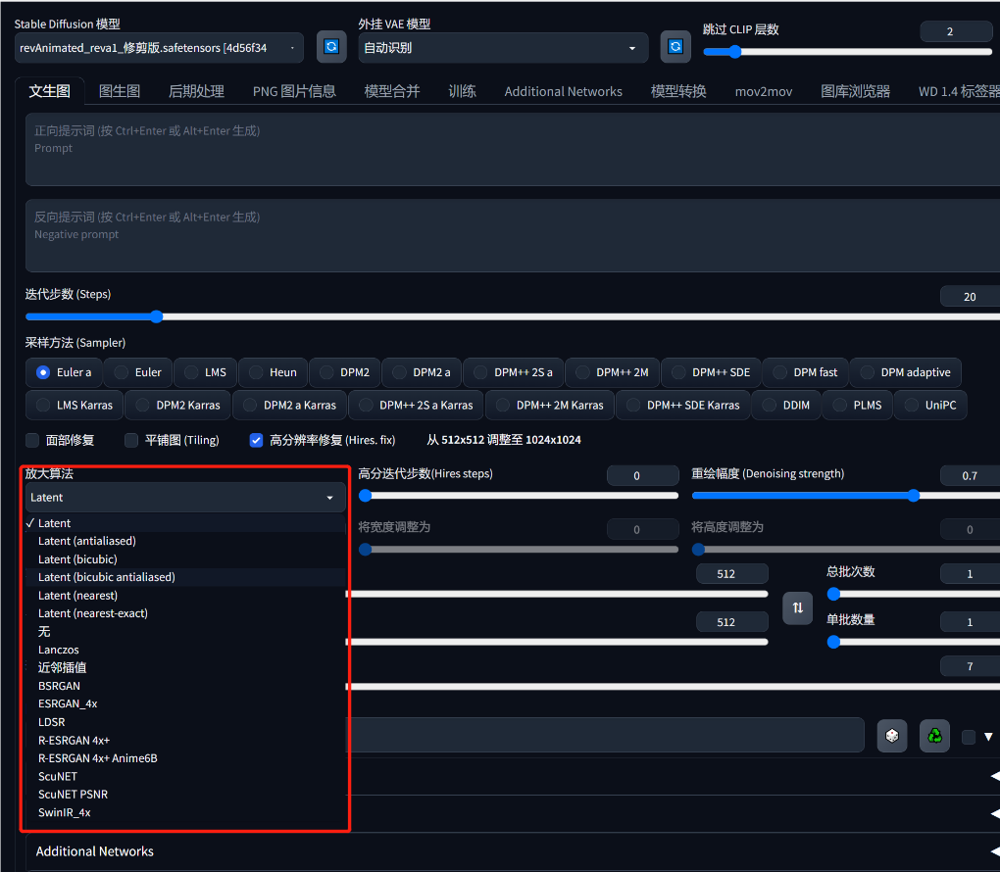
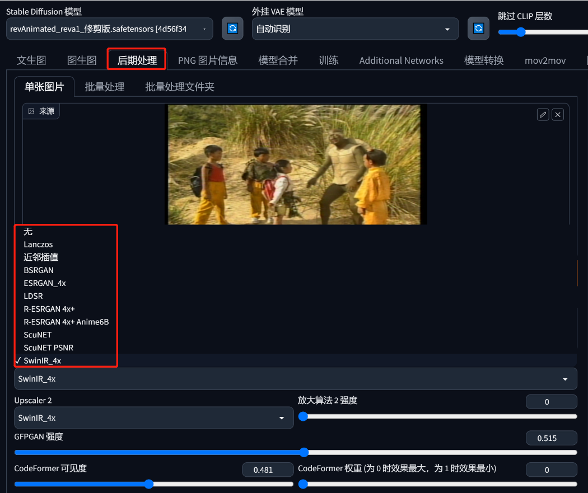
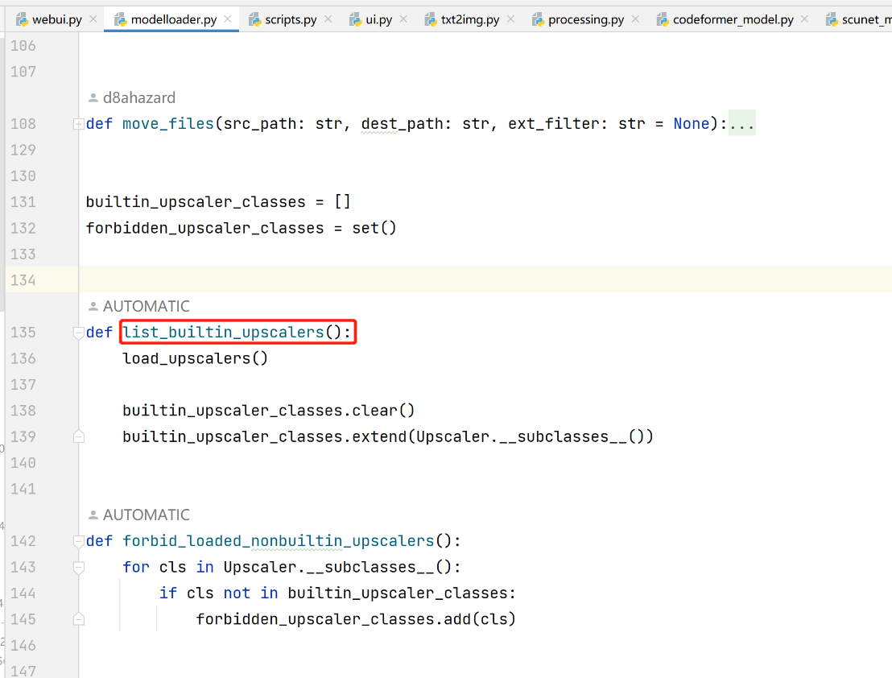
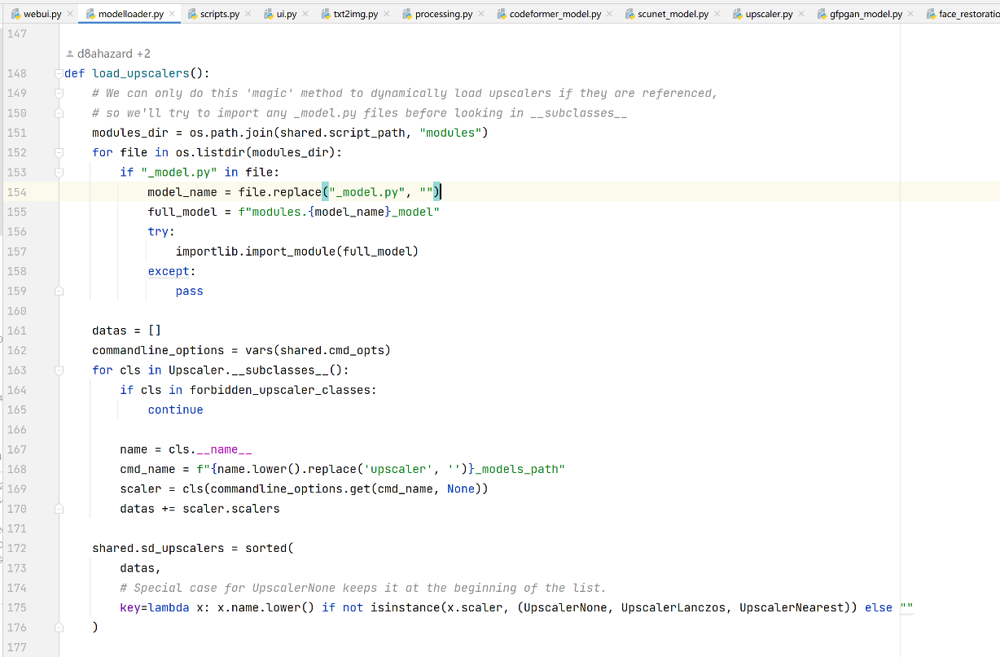
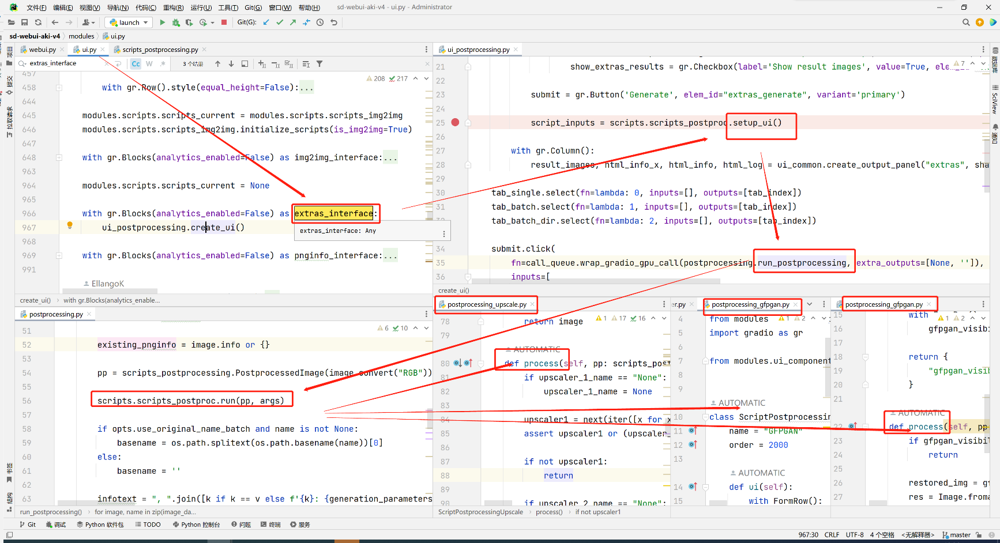

# sd源码分析13：高清修复-超分
> 这里收集了很多视频和图像的超分：https://github.com/JingyunLiang

## 一. 界面显示
- Latent 6种
- none   1种
- 其他   10种
    - Lanczos
    - Nearest
    - BSRGAN
    - ESRGAN
    - LDSR
    - R-ESRGAN
    - ScuNET
    - SwinIR

## 二. 加载

## 三. 调用
