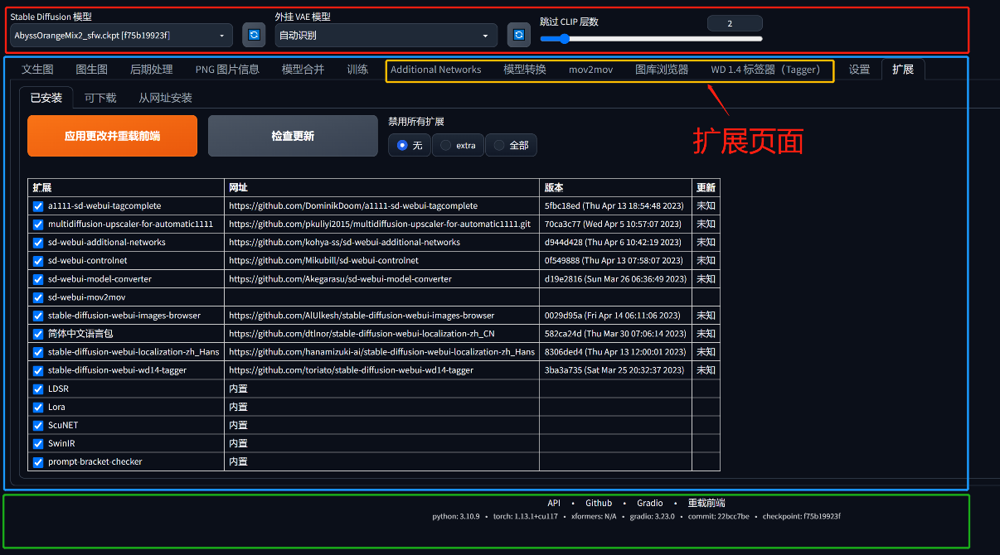
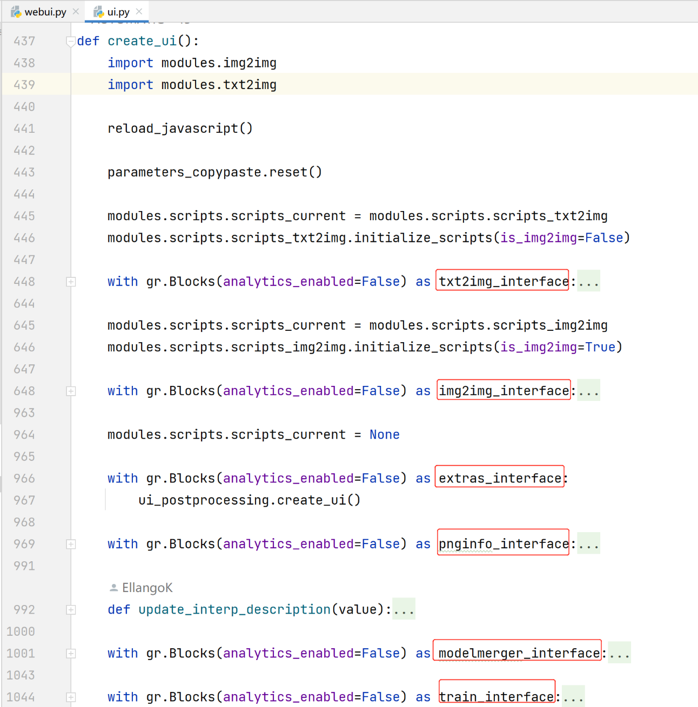
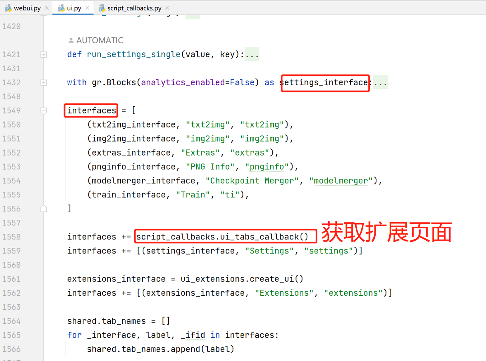
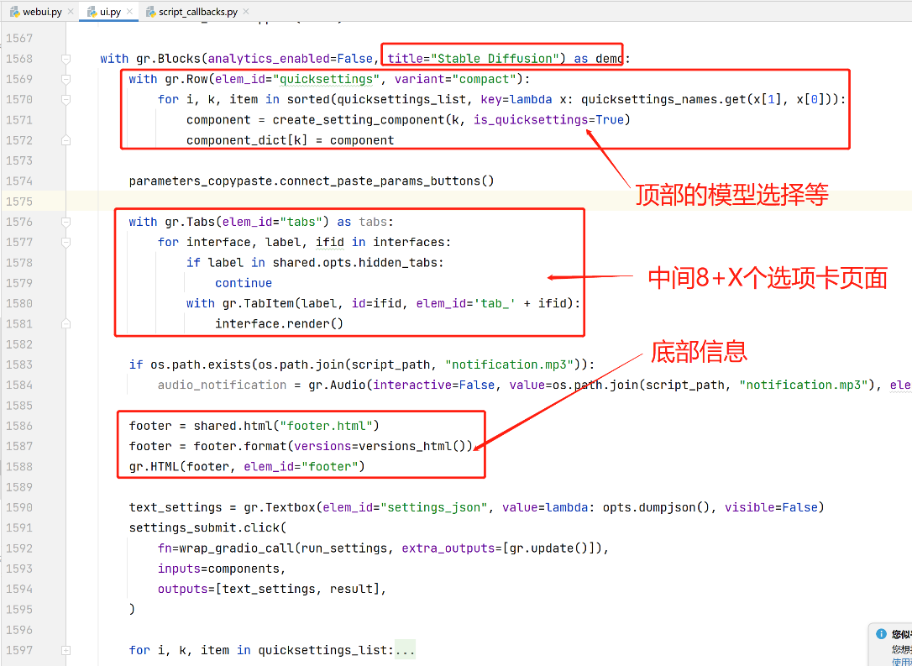
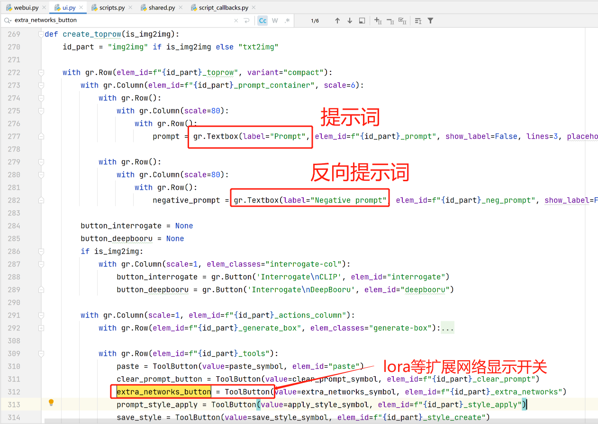
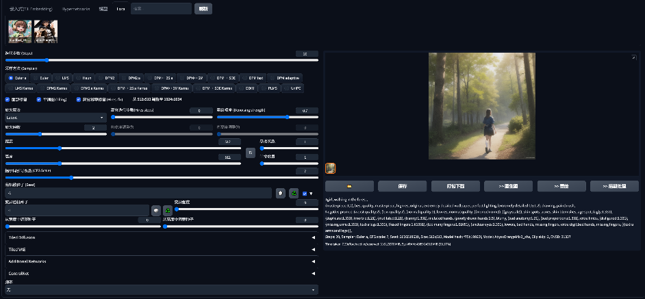
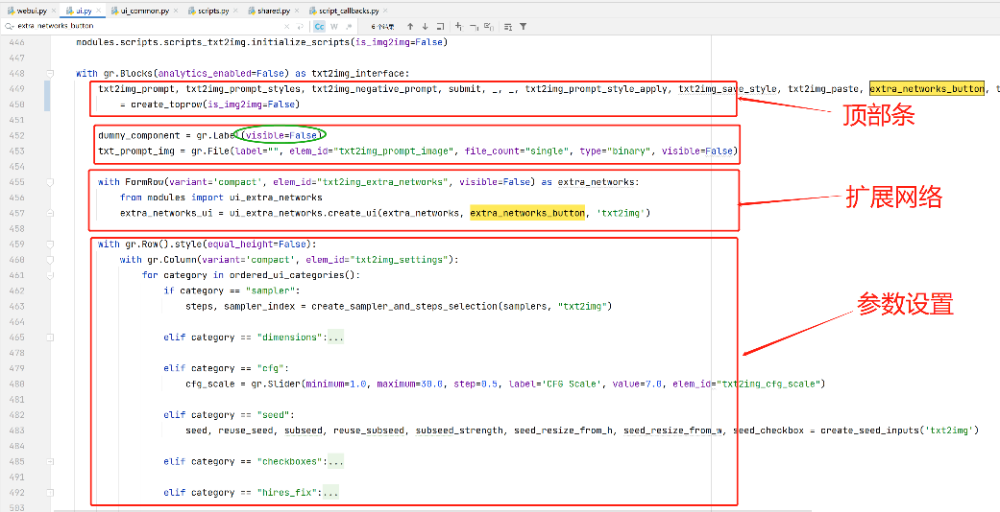
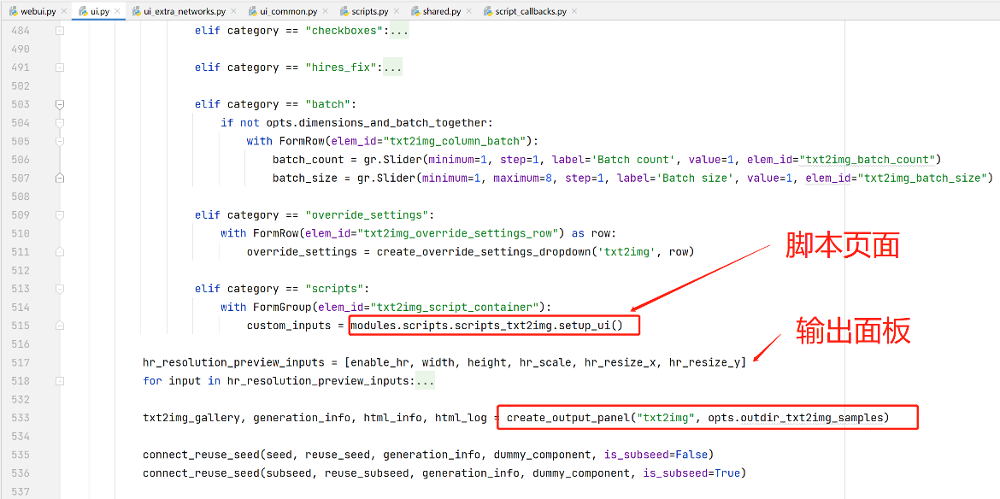

# sd源码分析3：ui界面布局

## 一. 页面结构：8个基本页面+扩展页面
1. txt2img
2. img2img
3. Extras
4. PNG Info
5. Checkpoint Merger
6. Train
7. **扩展页面加载这里**
8. Settings
9. Extensions

## 二. 文生图-顶部栏
> 文生图和图生图共用顶部栏，共用一个create_toprow函数创建

## 三. 文生图-参数设置

## 四. 其他页面和内部细节暂时略过
1. 图生图等页面
2. 扩展网络页面
3. 脚本页面