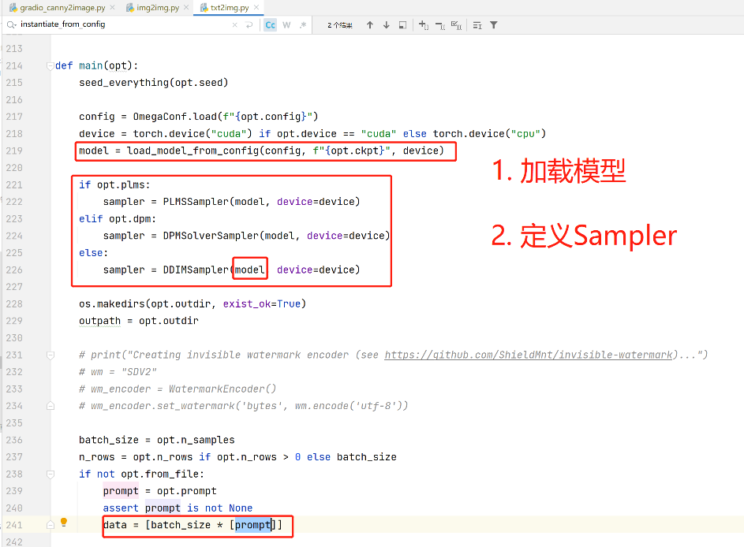
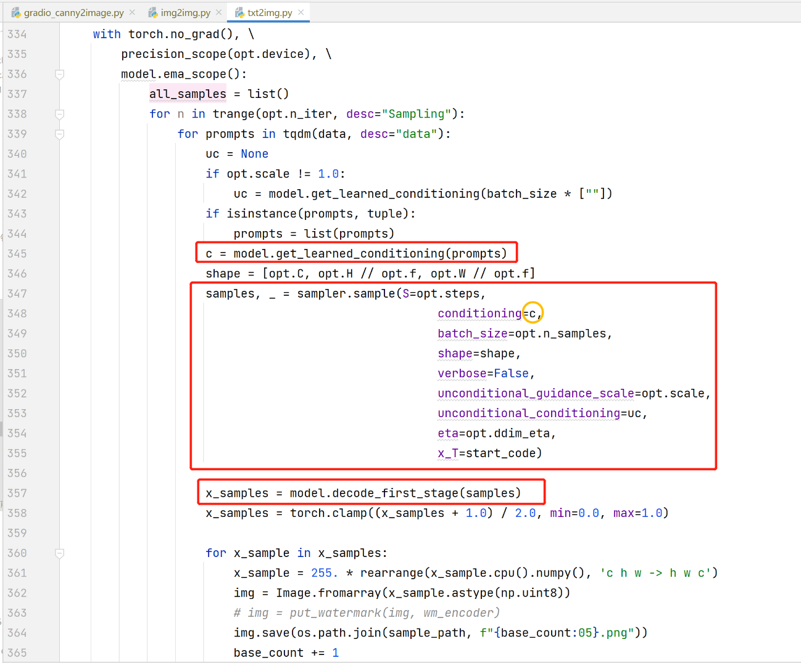
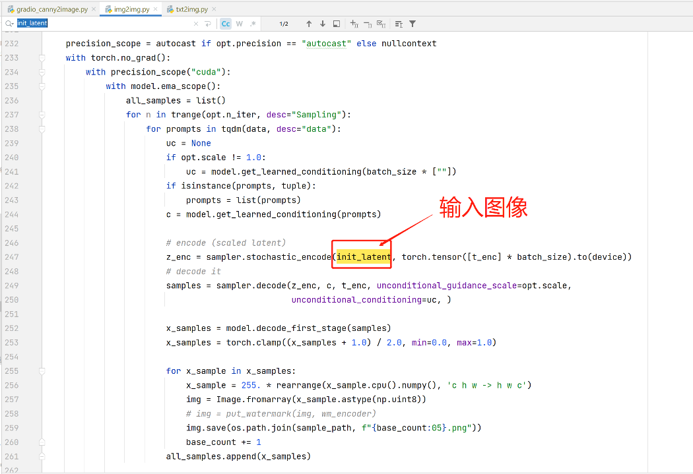
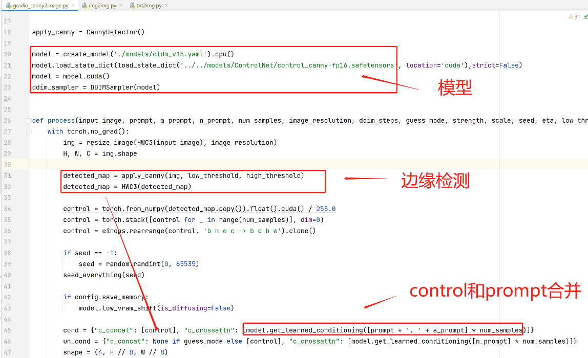
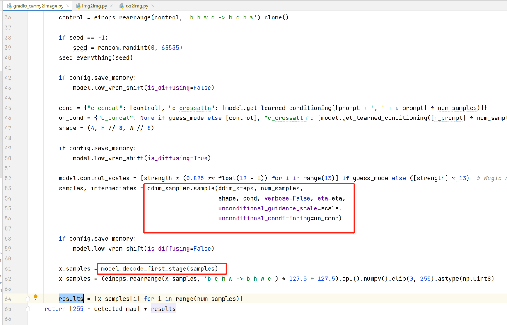

# sd源码分析4：stableDuffision-ControlNet基本模型与接口调用

## 一. 文生图
> repositories/stable-diffusion-stability-ai/scripts/txt2img.py

## 二. 图生图
> repositories/stable-diffusion-stability-ai/scripts/img2img.py

## 三. ControlNet的文生图
> repositories/ControlNet/gradio_canny2image.py

