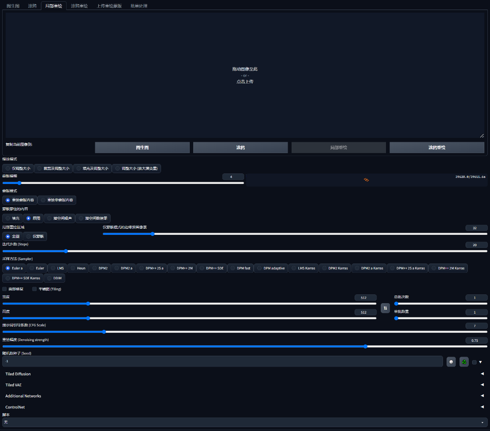

# sd源码分析7：图生图与局部重绘
> modules/img2img.py

## 一. 功能


## 二. 流程
1. img2img_prompt.submit(**img2img_args)
2. wrap_gradio_gpu_call+wrap_gradio_call
2. wrap_gradio_call
3. modules.img2img.img2img
4. processed = process_images(p)/modules.scripts.scripts_img2img.run(p, *args)
5. process_images_inner
6. samples_ddim = p.sample(...)
   1. sample_img2img
   2. samples = self.launch_sampling(t_enc + 1,...)
7. x_samples_ddim = decode_first_stage(...)

## 三. 核心函数modules.img2img.img2img
1. prompt=prompt 提示词
2. negative_prompt=negative_prompt 反向提示词
2. init_images=[image] 指定图像
2. mask指定局部, 被转换成p的image_conditioning
```
p = StableDiffusionProcessingImg2Img(
        sd_model=shared.sd_model,
        outpath_samples=opts.outdir_samples or opts.outdir_img2img_samples,
        outpath_grids=opts.outdir_grids or opts.outdir_img2img_grids,
        prompt=prompt,
        negative_prompt=negative_prompt,
        styles=prompt_styles,
        seed=seed,
        subseed=subseed,
        subseed_strength=subseed_strength,
        seed_resize_from_h=seed_resize_from_h,
        seed_resize_from_w=seed_resize_from_w,
        seed_enable_extras=seed_enable_extras,
        sampler_name=sd_samplers.samplers_for_img2img[sampler_index].name,
        batch_size=batch_size,
        n_iter=n_iter,
        steps=steps,
        cfg_scale=cfg_scale,
        width=width,
        height=height,
        restore_faces=restore_faces,
        tiling=tiling,
        init_images=[image],
        mask=mask,
        mask_blur=mask_blur,
        inpainting_fill=inpainting_fill,
        resize_mode=resize_mode,
        denoising_strength=denoising_strength,
        image_cfg_scale=image_cfg_scale,
        inpaint_full_res=inpaint_full_res,
        inpaint_full_res_padding=inpaint_full_res_padding,
        inpainting_mask_invert=inpainting_mask_invert,
        override_settings=override_settings,
    )
```


