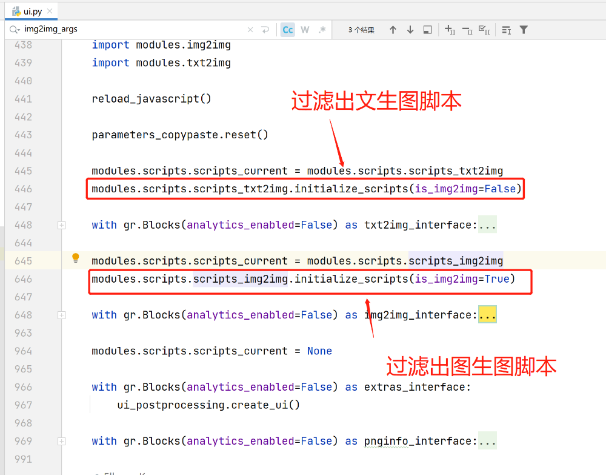
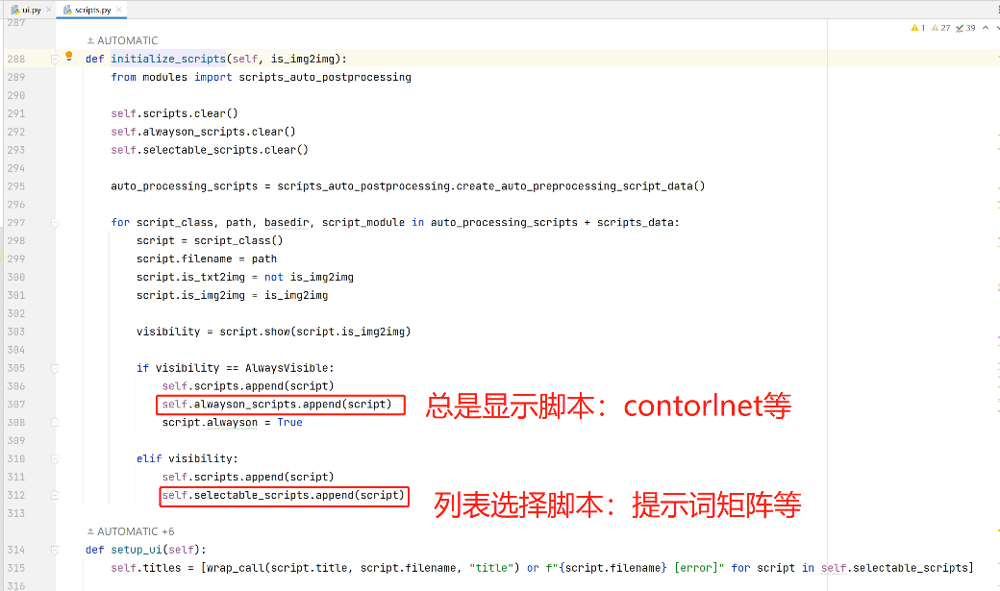
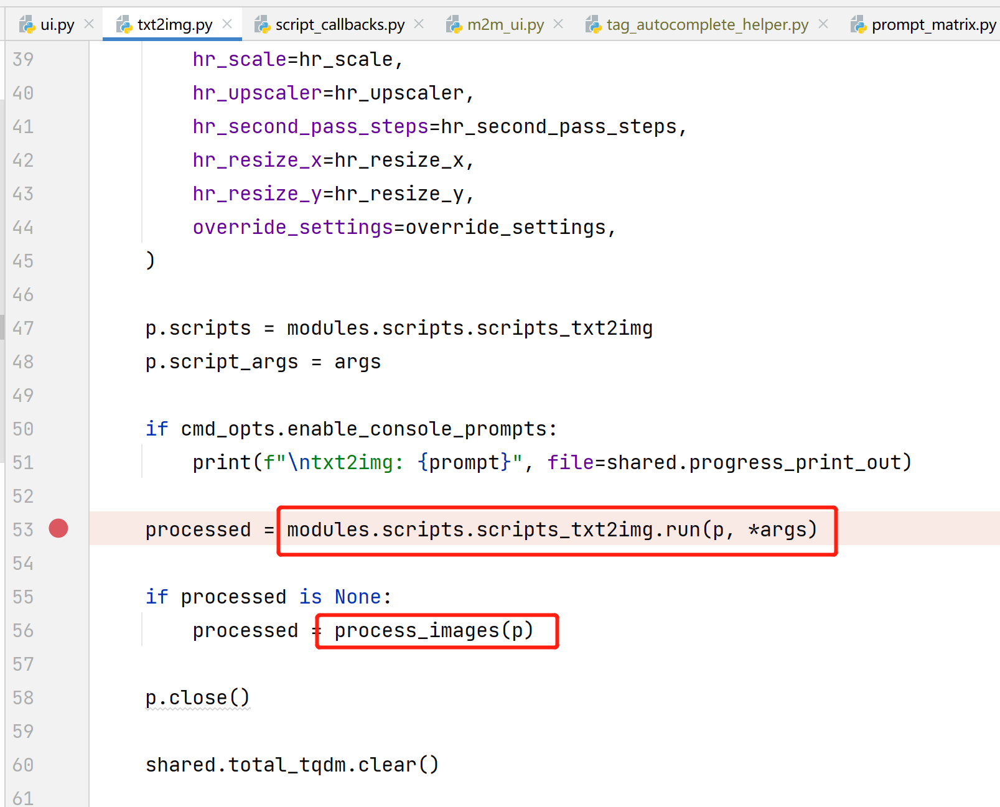

# sd源码分析8：脚本

## 一. 启动时加载所有插件
读取scripts目录+extendions目录


## 二. 文生图和图生图加载各自的插件



## 三. 扩展和脚本的定义
1. 自定义脚本
   - sd扩展可以包含脚本，如controlnet
   - 脚本也可以直接扔到scripts目录
   - 必须实现Script的子类
2. 自定义扩展：如果想出现在主tab或者设置页面实现下面的接口
```
script_callbacks.on_ui_settings(on_ui_settings)  # 注册进设置页
script_callbacks.on_ui_tabs(on_ui_tabs)
```

## 四. 脚本运行：接管模型的执行
- 