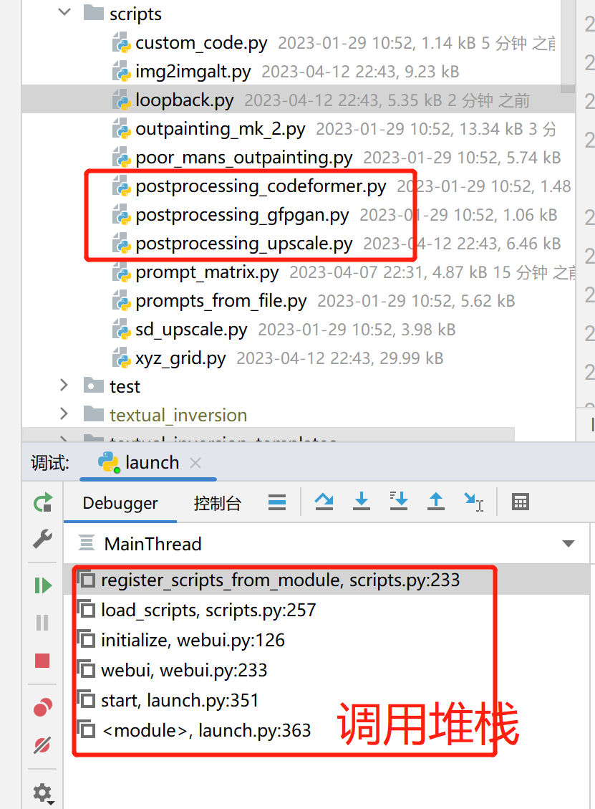

# sd源码分析9：自定义脚本和扩展
> 照着模板写就行

## 一. 启动时加载所有script目录
读取scripts目录+extendions目录


## 二. 扩展和脚本的定义
1. 自定义脚本
   - sd扩展可以包含脚本，如controlnet
   - 脚本也可以直接扔到scripts目录
   - 必须实现Script的子类
2. 自定义扩展：**如果想出现在主tab或者设置页面实现下面的接口**
```
script_callbacks.on_ui_settings(on_ui_settings)  # 注册进设置页
script_callbacks.on_ui_tabs(on_ui_tabs)
```

## 三. 开发文档
- https://github.com/AUTOMATIC1111/stable-diffusion-webui/wiki/Developing-extensions
- https://link.zhihu.com/?target=https%3A//github.com/AUTOMATIC1111/stable-diffusion-webui/wiki/Developing-custom-scripts
