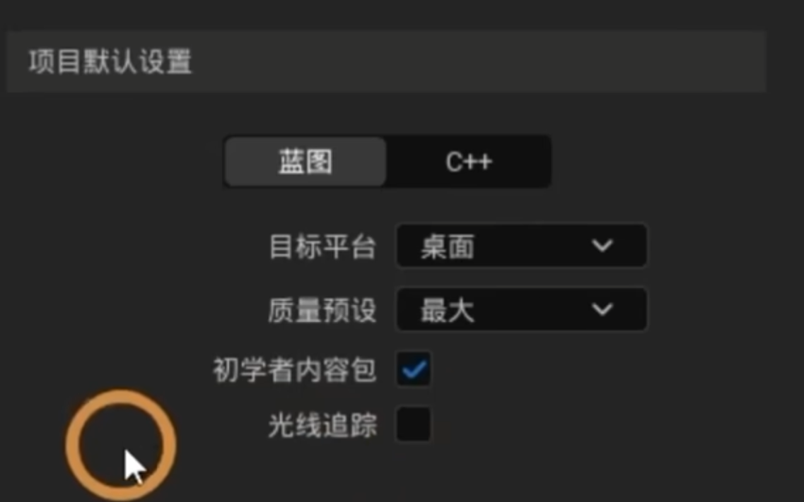

# ue5学习
> https://www.bilibili.com/video/BV1Cd4y1V7G5
> 
> 使用最新的UE5.1版本，包含10节理论课，6节实操课，总共整整500分钟

## 总结
1. epic公司
2. ue支持：游戏，影视，设计等
3. 两种开发模型：蓝图和c++
4. 模型组合编辑
5. 资产的导入
6. 材质的编辑

## 一. 理论基础
### P1 【虚幻引擎】爆肝两个月！拜托三连了！这绝对是全B站最用心的UE5.1全中文新手入门公开教程，耗时千余小时开发！ 07:16
### P2 s01-虚幻引擎安装及创建工程说明讲解 20:32
1. 下载安装软件：https://www.epicgames.com/site/zh-CN/home
2. 界面与项目默认设置：
3. 配置缓存到项目目录
### P3 s02-用户操作界面介绍及操作 13:34
1. actor：演员，所有的对象都是actor
2. 移动：鼠标右键+WASD + EQ
3. 界面布局和操作
### P4 s03-创建和移动物体 37:09
1. 从内容浏览器 加载物体，然后位移、旋转、缩放。
2. 设计了一个会议室
### P5 s04-1 导入模型资产 24:47
1. 坐标系在底部中心
2. maya导出FBX，2020格式
### P6 s04-2 导入贴图资产 07:50
1. 贴图资源库： polyhaven.com
### P7 s04-3 导入资产包 12:15
1. 从epic商城导入
2. 从其他项目拷贝
3. 从其他项目迁移
### P8 s04-4 导入bridge资产包 06:18
1. 从QuixelBridge下载
### P9 s05-材质基础认知 30:10
1. 材质编辑器
2. 材质：渲染属性，包括纹理，粗糙度，光照法线等
3. 材质应用：拖到对象上
4. 材质参数控制
### P10 s06-光照系统介绍 33:39
1. 点光源
2. 聚光源
3. 矩形光源
4. 环境光源混合器 
### P11 s07-地形系统介绍 28:15
### P12 s08-植被系统介绍 17:32
### P13 s09-Nanite网络体介绍 21:27
### P14 s10-Megascans材质球讲解及调整 19:41
## 二. 实战
### P15 s11-实战：搭建分析及基础环境关卡创建 25:38
### P16 s12-实战：洞内大致环境搭建讲解 09:07
### P17 s13-实战：搭建基础环境（纯操作） 1:00:10
### P18 s14-实战：细化山洞内部结构 30:10
### P19 s15-实战：增加场景氛围细化材质细节 50:35
### P20 s16-实战：搭建最终效果制作 16:49

参考
AI辅助-影视级3D写实角色《虚拟人-梦琪》案例制作流程【影视游戏双流程】
https://www.yiihuu.com/a_11758.html?TG=3881061&BD_01=KMBDPC_MAYA_CC2&bd_vid=10660063317045454316