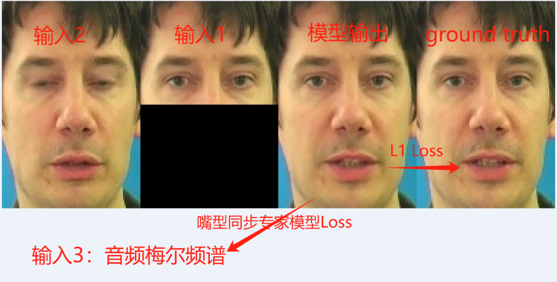

# wav2lip原理

## wav2lip为啥要用6个通道，其中3个是遮住嘴巴的图？只用三个通道不行吗？
1. 原因：
    - 因为只给一张图片，不知道它在不同的声音驱动下正确的嘴型同步后的图像分别应该是什么样子。
    - 也就是你不知道训练时候的ground truth。
2. 用图解释
   
   - 如果图像输入仅仅有输入2：不对，因为推理需要基本copy输入1的上半部分。
   - 如果图像输入仅仅有输入1：没有mask肯定不行，输入和ground truth相同，那样就不需要训练的。 有mask也不行，鼻子嘴巴模型没见过全靠生成难以训练好。
   - 所以：必须有输入2让模型知道鼻子嘴巴的样子，必须有输入1让模型正确输出上半部分，输入1必须有mask来排除与ground truth相同部分带来的干扰。

3. 思考
   - 如果有已经成熟的模型嘴型同步模型，用他的结果去训练。就可以只需要3通道输入，且训练速度应该快很多。
   - wav训练和推理的输入是不一样的：训练输入两图的上半部分不相同，推理的时候相同。 这可能要求更长的训练时间来解决这种不同。
