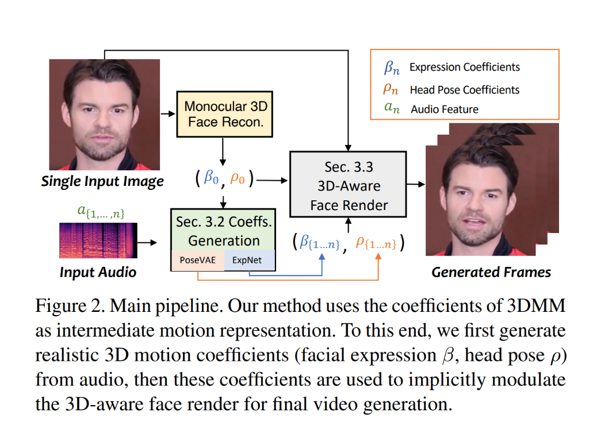
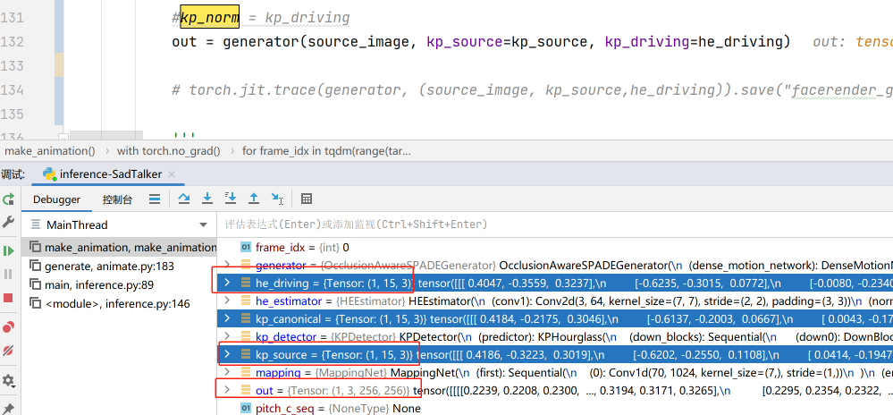

网络列表：
1. 人脸检测
   - facexlib的detection_Resnet50_Final.pth
2. 人脸关键点检测
   - facexlib的alignment_WFLW_4HG.pth +landmark_98_to_68
2. 3D人脸重建：
   - face_3drecon
2. audio2pose
2. audio2exp
4. facevid2vid
   - self.kp_extractor = kp_extractor //关键点检测
   - self.mapping = mapping           //映射网络
   - self.generator = generator       //生成每一帧
   - self.he_estimator = he_estimator //None
5. 人脸增强：多选一
   - gfpgan
   - RestoreFormer
   - CodeFormer
6. 背景增强： realesrgan

sadtalker自己训练
- face_3drecon
- audio2pose
- audio2exp
- mapping

facevid2vid代码来自
https://github.com/zhanglonghao1992/One-Shot_Free-View_Neural_Talking_Head_Synthesis

face3d代码来自
https://github.com/deepinsight/insightface/tree/00f98ef7331d41c9ce7c54a306fcd228106874c7/recognition/arcface_torch
https://github.com/sicxu/Deep3DFaceRecon_pytorch
https://github.com/microsoft/Deep3DFaceReconstruction
https://github.com/RenYurui/PIRender

## 关于safetensors
https://github.com/huggingface/safetensors

## 知识：
1. 人脸对齐1：https://zhuanlan.zhihu.com/p/405746101
2. 人脸对齐2：https://blog.csdn.net/qq_42722197/article/details/121668671

## 关于face3d
https://faces.dmi.unibas.ch/bfm/?nav=1-0&id=basel_face_model
https://github.com/qianjinhao/3D-face-papers

介绍
在千禧年的下半年, 3DMM(3D Morphable Model)横空出世(中文名: 3D 可变形模型/参数化模型), 奠定了 10 多年后 3D Avatar(数字人/虚拟人)落地开花的基础
https://zhuanlan.zhihu.com/p/634381271
https://www.cnblogs.com/shiyanhe/p/13080804.html
https://zhuanlan.zhihu.com/p/598723461
https://zhuanlan.zhihu.com/p/611044607
https://github.com/yfeng95/face3d
https://github.com/qianjinhao/3D-face-papers
https://blog.csdn.net/weixin_43955293/article/details/119935411
https://zhuanlan.zhihu.com/p/638520911

c++可视化
https://www.cnblogs.com/bemfoo/p/11788638.html
https://github.com/Great-Keith/bfm-visual-tool

