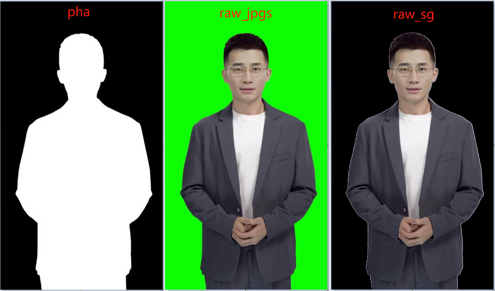

# 硅基开源数字人
> https://github.com/GuijiAI/duix.ai
> 开源了：sdk和demo、模型。
> 没开源：模型训练方法。

## 一. 项目文件分析
1. 概况
   - Android存放的路径：/sdcard/Android/data/ai.guiji.duix.test/files/duix
   - 
   - 模型采用aesc加密，又解压出来放到存储卡上。 加密意义呢？
   - 文件解密后对应关系
   ```
     baseMD5Map.put("alpha_model.b", "ab");
     baseMD5Map.put("alpha_model.p", "ap");
     baseMD5Map.put("cacert.p", "cp");
     baseMD5Map.put("weight_168u.b", "wb");
     baseMD5Map.put("wenet.o", "wo");

     modelMD5Map.put("dh_model.b", "db");
     modelMD5Map.put("dh_model.p", "dp");
     modelMD5Map.put("bbox.j", "bj");
     modelMD5Map.put("config.j", "cj");
     modelMD5Map.put("weight_168u.b", "wb");     // 不一定有
   ```
   - 下载和解密后的文件
   ```
   ls -lh /sdcard/Android/data/ai.guiji.duix.test/files/duix/*
   
   /sdcard/Android/data/ai.guiji.duix.test/files/duix/gj_dh_res:
   total 266M
   -rw-rw---- 1 u0_a342 ext_data_rw  63K 2024-06-08 11:49 ab
   -rw-rw---- 1 u0_a342 ext_data_rw  63K 2024-06-08 11:43 alpha_model.b
   -rw-rw---- 1 u0_a342 ext_data_rw 1.2K 2024-06-08 11:43 alpha_model.p
   -rw-rw---- 1 u0_a342 ext_data_rw 1.1K 2024-06-08 11:49 ap
   -rw-rw---- 1 u0_a342 ext_data_rw 218K 2024-06-08 11:43 cacert.p
   -rw-rw---- 1 u0_a342 ext_data_rw 218K 2024-06-08 11:49 cp
   -rw-rw---- 1 u0_a342 ext_data_rw   36 2024-06-08 11:43 uuid
   -rw-rw---- 1 u0_a342 ext_data_rw  25K 2024-06-08 11:49 wb
   -rw-rw---- 1 u0_a342 ext_data_rw  25K 2024-06-08 11:43 weight_168u.b
   -rw-rw---- 1 u0_a342 ext_data_rw 133M 2024-06-08 11:43 wenet.o
   -rw-rw---- 1 u0_a342 ext_data_rw 133M 2024-06-08 11:49 wo
   
   /sdcard/Android/data/ai.guiji.duix.test/files/duix/bendi3_20240518:
   total 29M
   -rw-rw---- 1 u0_a342 ext_data_rw 16K 2024-07-02 17:38 bbox.j
   -rw-rw---- 1 u0_a342 ext_data_rw 15K 2024-07-02 17:38 bj
   -rw-rw---- 1 u0_a342 ext_data_rw  95 2024-07-02 17:38 cj
   -rw-rw---- 1 u0_a342 ext_data_rw 128 2024-07-02 17:38 config.j
   -rw-rw---- 1 u0_a342 ext_data_rw 14M 2024-07-02 17:38 db
   -rw-rw---- 1 u0_a342 ext_data_rw 14M 2024-07-02 17:38 dh_model.b
   -rw-rw---- 1 u0_a342 ext_data_rw 11K 2024-07-02 17:38 dh_model.p
   -rw-rw---- 1 u0_a342 ext_data_rw 11K 2024-07-02 17:38 dp
   drwxrws--- 2 u0_a342 ext_data_rw 24K 2024-07-02 17:38 pha
   drwxrws--- 2 u0_a342 ext_data_rw 24K 2024-07-02 17:38 raw_jpgs
   drwxrws--- 2 u0_a342 ext_data_rw 24K 2024-07-02 17:38 raw_sg
   -rw-rw---- 1 u0_a342 ext_data_rw  36 2024-07-02 17:38 uuid
   -rw-rw---- 1 u0_a342 ext_data_rw 25K 2024-07-02 17:38 wb
   -rw-rw---- 1 u0_a342 ext_data_rw 25K 2024-07-02 17:38 weight_168u.b

   /sdcard/Android/data/ai.guiji.duix.test/files/duix/wav:
   total 100K
   -rw-rw---- 1 u0_a342 ext_data_rw 96K 2024-06-08 12:22 help.wav
   ```
2. 模型列表
   > 硅基用 一个wenet+munet。 webnet 133MB, 处理音频，每个人物一个munet模型，只有 8M。
   - 公用模型：
     - alpha_model：并没有使用，用传统的融合方法。 用168x168做简单均值滤波。
     - cacert：证书
     - wenet：提取音频特征, onnx模型格式，输出20x256
     - weight_168u：unetmsk, 160x160, rgb8，用于推理完成后只保留嘴部的alpha融合。 优先用人物模型的weight_168u。
   - 人物模型: 
     - dh_model：口型同步，ncnn模型格式，输入160,160,6 + 20,256,1
     - weight_168u：unetmsk, 160x160, rgb8，比公用weight_168u更精细

## 二. 图像资源
1. 人物：540x960
   - liangwei ,Valentin等
2. 人物图片
   硅基直接把视频转成图片序列下载到客户端
    -  
    - raw_jpgs用于推理：用raw_jpgs里面的图像把脸部和颈部剪裁出来用于推理
    - pha：用于opengl渲染的mask
    - raw_sg：作用不理解，看样子是想让opengl就渲染带背景的。
3. 硅基的视频帧筛选方案：
   - 视频帧可以分成若干个 静默区间和动作区间，如果没有就所用帧作为唯一一个静默区间
   - 默认播放就是静默区间【正序+逆序】循环
   - 用户只有调用接口请求动作，会从动作区间里面随机挑选一个播放一次直到完成。
4. 推理
    -   
    - 用 左图+中图 推理后与 右图融合。
    - 左图： 160x160
    - 中图：在左图基础上加mask：cv::Rect(5,5,150,145)
    - 右图：用于用alpha融合只保留推理后的嘴部g管理
   
## 三. 模型结构
1. 硅基的wav2lip 图像编码，输入160x160
    - 第一层： 
      - conv:6x32  + dp-conv:32x16  输出 80x80
    - 第二层： 
      - conv:16x96 + dp-conv:96x24  输出 40x40
      - redius: conv:24x144 + dp-conv:144x24      
    - 第三次： 
      - conv:24x144 + dp-conv:144x32    输出 20x20
      - redius1: conv:32x192 + dp-conv:192x32
      - redius2: conv:32x192 + dp-conv:192x32
    - 第四次： 
      - conv: 32x192 + dp-conv:192x64     输出 10x10
      - redius: conv: 64x384 + dp-conv:384x64   
      - redius: conv: 64x384 + dp-conv:384x64   
      - redius: conv: 64x384 + dp-conv:384x64   
      - conv: 64x384 + dp-conv:384x96 
      - redius: conv: 96x576 + dp-conv:576x96 
      - redius: conv: 96x576 + dp-conv:576x96 
    - 第五层
      - conv:  96x576 + dp-conv:576x160     输出 5x5
      - redius: conv: 160x960 + dp-conv:960x160
      - redius: conv: 160x960 + dp-conv:960x160
      - conv: 190x960 + dp-conv:960x320 +  conv: 320x320

## 四. Android调用逻辑
1. MainActivity：下载解压基础模型、人物模型。
2. CallAcitivity：运行模型，渲染视频
3. DUIX+DUIXThread: 核心流程
   - DUIX(): 
     - scrfdncnn = new SCRFDNcnn()：创建c++对象
     - renderThread.start(): 创建ExoPlayer
   - init()
     - ModelInfo info = ModelInfo.loadResource(scrfdncnn, baseDir, modelDir) 
     - duixRender.startPreview(info);
       - handleStartRender
       - handleAudioStep
         - renderStep：循环渲染
     - scrfdncnn.config(info.getNcnnConfig());
       - initCurl ：用证书初始化Curl
       - initWenet ： 初始化Wenet
       - initMunet ： 初始化Munet
       - initMalpha : 初始化Malpha网络
       - initScrfd ：没有用到
       - initPfpld ：没有用到
     - scrfdncnn.start();
   - playAudio()
     - handlePrepareAudio
     - loadAudio
     - int all_bnf = scrfdncnn.onewav(path, "")
     - handlePlayAudio
       - mTotalBnf = all_bnf ： 设置帧数，renderStep就能不断处理
       - mExoPlayer.prepare(true)：用mExoPlayer播放音乐
   - renderStep()
     - frame = mPreviewQueue.poll(); 取出一帧的视频
     - float curr = mTotalBnf * progress; 用ExoPlayer播放的位置点位音频
     - scrfdncnn.mskrstbuf ： 有音频 + 有mask
     - scrfdncnn.onerstbuf ： 有音频 + 无mask
     - scrfdncnn.drawmskbuf： 无音频 + 有mask
     - scrfdncnn.drawonebuf： 无音频 + 无mask
     - renderSink.onVideoFrame: 调用opengl渲染
   - motion(): 请求选择一个动作区间的帧序列开始进行推理
4. DigitJni.cpp + GDigit.h + GDigit.cpp ：JNI底层
   - static GDigit* g_digit = 0; 全局一个GDigit对象
   - Java_com_btows_ncnntest_SCRFDNcnn_onewav: 音频处理
     - GDigit::newwav(...)
       - asyncNetwav(1,wm) ： 删除net_wavmat
       - net_wavmat = new KWav(wavfn,bnf_cache) ： 创建新的net_wavmat
       - wenetThread->post(9999,net_wavmat) ：运行wenet
   - GDigit::mskrstbuf：有音频 + 有mask
     - mat_pic->load(picfile) ：加载图片
     - mat_msk->load(mskfile) ：加载mask
     - mat_fg->load(fgfile)   ：加载sg
     - JMat* mat_feat = bnf_cache->inxBuf(index) ：加载wenet的音频特征
5. wenet.cpp：音频特征wenet模型的推理
6. munet.cpp：口型同步munet模型(类似wav2lip)的推理
7. malpha.cpp: 图像的拷贝融合等

## 五. 扩展
1. 猜测人物模型定制流程：
   - 一段3分钟的视频
   - 抠图：得到绿幕图，黑白mask，黑背景图
   - 人脸检测：取下半张脸，往下延展到1比1。得到box，生成weight_168u。
   - 用绿幕图给wav2lip预处理和训练，声音特征wenet替换mel
   - 应该是有底模，可能没用专家同步模型用L1损失训练。